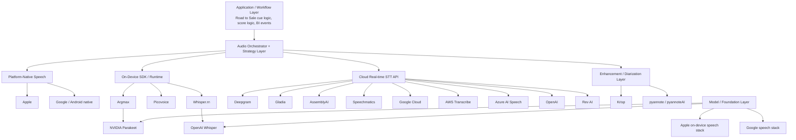

# Road to Sale Audio Landscape

## Purpose

This document maps the companies, products, and technical layers relevant to the `Road to Sale by AuditPro` voice stack.

It is meant to answer:
- who sits at which layer
- which companies overlap
- where we have strategy choices
- which layers are likely to remain our responsibility

Related docs:
- `docs/ROAD_TO_SALE_AUDIO_ARCHITECTURE.md`
- `dev/docs/ROAD_TO_SALE_AUDIO_LEARNINGS.md`
- `dev/docs/ROAD_TO_SALE_AUDIO_TELEMETRY.md`

Last updated:
- `2026-05-22`

## Layer Diagram

## Layer Summary

| Layer | What it means | Example companies / technologies | Why it matters to us |
|---|---|---|---|
| Application / workflow | Cue logic, score logic, BI events, overrides | `Road to Sale by AuditPro` | This is our product IP |
| Orchestrator / strategy | Chooses which engine runs, normalizes outputs | Our app architecture | This keeps us vendor-flexible |
| Platform-native speech | Speech capabilities built into iOS / Android ecosystems | Apple, Google / Android | May be cheapest and fastest on some devices |
| On-device SDK / runtime | Third-party SDKs or local runtimes on device | Argmax, Picovoice, whisper.rn | Useful for low latency and local processing |
| Cloud real-time STT | Streaming APIs over network | Deepgram, Gladia, AssemblyAI, Speechmatics, Google Cloud, AWS, Azure, OpenAI, Rev AI | Faster to integrate, less device burden |
| Model / foundation | Base ASR models or runtimes behind products | NVIDIA Parakeet, OpenAI Whisper | Important for understanding vendor claims and portability |
| Enhancement / diarization | Noise suppression, speaker separation, audio cleanup | Krisp, pyannote | May materially affect rep-floor accuracy and evidence quality |
| Downstream audio intelligence | Summaries, structured output, diarization, sentiment | Gladia, AssemblyAI, Speechmatics, app-layer LLMs | Useful later, not our first live-path decision |

## Company / Technology Mapping

| Company / tech | Primary layer | Secondary layer | What it appears to offer | Why it is interesting |
|---|---|---|---|---|
| Apple SpeechTranscriber | Platform-native speech | Model/runtime hidden inside Apple stack | Real-time on-device transcription on modern Apple devices | Strong iOS candidate with low platform friction |
| Google Android native speech APIs | Platform-native speech | OS-level recognizer behavior | Partial results and native Android speech integration | Important baseline, though not always best for continuous speech |
| Google Cloud Speech-to-Text | Cloud real-time STT | Enterprise cloud AI | Streaming STT with interim/final behavior | Relevant benchmark and fallback option |
| AWS Transcribe | Cloud real-time STT | Enterprise cloud AI | Streaming and batch STT inside AWS ecosystem | Important enterprise benchmark |
| Azure AI Speech | Cloud real-time STT | Enterprise cloud AI | Real-time STT, translation, enterprise speech services | Important enterprise benchmark |
| OpenAI speech/audio APIs | Cloud real-time STT | Foundation-model ecosystem | Speech-to-text and audio model access | Relevant if product later consolidates around OpenAI stack |
| Rev AI | Cloud real-time STT | Developer speech API | Streaming speech-to-text APIs | Useful benchmark in API-first STT layer |
| Argmax Pro SDK | On-device SDK / runtime | Model packaging / real-time transcription | Real-time STT, custom vocabulary, cross-platform SDK | Strong v1 candidate, especially for Android |
| Argmax / WhisperKit | On-device SDK / runtime | Open-source model tooling | Real-time / local transcription patterns and output model | Good conceptual and implementation reference |
| Deepgram | Cloud real-time STT | Voice-agent / speech platform | Real-time streaming STT, agent-focused positioning | Useful benchmark and common market reference |
| Gladia | Cloud real-time STT | Audio intelligence | Real-time STT plus structured audio intelligence | Good telemetry and latency thinking source |
| AssemblyAI | Cloud real-time STT | Audio intelligence / spoken-data platform | STT plus broader spoken-data tooling | Relevant alternative in cloud layer |
| Speechmatics | Cloud real-time STT | On-prem / local deployment options | Realtime and batch STT, voice SDK, local deployment options | Interesting for flexibility and on-prem angle |
| NVIDIA Parakeet | Model / foundation | Self-hosted ASR runtime | Streaming/offline ASR models, often via NIM / Argmax | Important underlying model family to understand |
| OpenAI Whisper | Model / foundation | Open-source base model | High-quality general ASR, not inherently perfect for real-time streaming | Key reference model in the ecosystem |
| Picovoice | On-device SDK / runtime | Capture / frame processing | Device-level voice processing and frame access | Useful for clean separation of capture from STT |
| whisper.rn | On-device integration layer | Open-source wrapper | Whisper-family integration in React Native with VAD-related controls | Useful implementation reference, not a complete product answer |
| Krisp | Enhancement / diarization | Noise cancellation | Voice isolation and noise suppression APIs / SDKs | Interesting if showroom noise becomes a major blocker |
| pyannote | Enhancement / diarization | Open-source diarization toolkit | Speaker diarization tooling and research lineage | Useful reference point for speaker separation |
| pyannoteAI | Enhancement / diarization | Commercial diarization API | Dedicated diarization product, including Precision-2 | Important if accurate post-call speaker attribution becomes necessary |

## Platform-Native Layer

| Player | Official source | Source date status | What layer it sits in | Notes |
|---|---|---|---|---|
| Apple SpeechTranscriber | https://developer.apple.com/documentation/speech/speechtranscriber | Checked `2026-05-22` | Native on-device iOS layer | Important for modern iPhone path |
| Android SpeechRecognizer / partials | https://developer.android.com/reference/android/speech/RecognitionListener.html | Crawled `2026-03` in search result | Native Android layer | Useful baseline, may be weaker for long continuous speech |
| Google Cloud Speech-to-Text | https://cloud.google.com/speech-to-text/docs/transcribe-streaming-audio | Published `~2025-10` in search result | Cloud STT layer | Separate from Android native APIs |

## On-Device SDK / Runtime Layer

| Player | Official source | Source date status | What layer it sits in | Notes |
|---|---|---|---|---|
| Argmax docs | https://app.argmaxinc.com/docs | Checked `2026-05-22` | On-device SDK / runtime | Broad product entry point |
| Argmax real-time transcription | https://app.argmaxinc.com/docs/examples/real-time-transcription | Checked `2026-05-22` | Real-time STT behavior | Important `hypothesis` / `confirmed` mental model |
| Argmax Pro SDK 2 | https://www.argmaxinc.com/blog/argmax-sdk-2 | Published `2026-04-07` | Cross-platform SDK | Strong Android signal |
| Picovoice Voice Processor | https://github.com/Picovoice/react-native-voice-processor | Checked `2026-05-22` | Capture / frame-processing layer | Useful architecture reference |
| whisper.rn | https://github.com/mybigday/whisper.rn | Checked `2026-05-22` | RN local integration layer | Useful for VAD and local controls |

## Cloud Real-Time STT Layer

| Player | Official source | Source date status | What layer it sits in | Notes |
|---|---|---|---|---|
| Deepgram STT docs | https://developers.deepgram.com/docs/stt/getting-started | Crawled `2026-05` | Real-time cloud STT | Important benchmark and alternative |
| Deepgram live streaming docs | https://developers.deepgram.com/docs/live-streaming-audio | Crawled `2026-05` | Real-time cloud STT | Useful for streaming behavior |
| Gladia docs | https://docs.gladia.io/ | Checked `2026-05-22` | Real-time cloud STT + audio intelligence | Good latency-thinking source |
| Gladia live STT features | https://docs.gladia.io/chapters/live-stt/features | Checked `2026-05-22` | Live STT feature layer | Useful for partial transcript handling |
| AssemblyAI docs | https://www.assemblyai.com/docs/ | Checked `2026-05-22` | Cloud STT + spoken-data platform | Relevant competitor in same layer |
| Speechmatics docs | https://docs.speechmatics.com/ | Checked `2026-05-22` | Cloud STT / local deployment / voice platform | Interesting flexibility story |
| Google Cloud Speech-to-Text docs | https://cloud.google.com/speech-to-text/docs/transcribe-streaming-audio | Checked `2026-05-22` | Cloud STT | Important hyperscaler baseline |
| AWS Transcribe streaming docs | https://docs.aws.amazon.com/transcribe/latest/dg/streaming.html | Checked `2026-05-22` | Cloud STT | Important hyperscaler baseline |
| Azure AI Speech docs | https://learn.microsoft.com/azure/ai-services/speech-service/ | Checked `2026-05-22` | Cloud STT | Important hyperscaler baseline |
| OpenAI speech-to-text guide | https://platform.openai.com/docs/guides/speech-to-text | Checked `2026-05-22` | Cloud STT / audio models | Important if unified OpenAI stack is later considered |
| Rev AI streaming docs | https://docs.rev.ai/api/streaming/ | Checked `2026-05-22` | Cloud STT | Useful benchmark in API-first speech layer |

## Enhancement / Diarization Layer

| Player | Official source | Source date status | What layer it sits in | Notes |
|---|---|---|---|---|
| Krisp developer docs | https://sdk-docs.krisp.ai/ | Checked `2026-05-22` | Noise suppression / enhancement | Relevant if environment noise is a large issue |
| pyannoteAI docs | https://docs.pyannote.ai/ | Checked `2026-05-22` | Speaker diarization | Commercial API and Precision-2 model docs |
| pyannoteAI models | https://docs.pyannote.ai/models | Checked `2026-05-22` | Speaker diarization | Precision-2 is the documented default model |
| pyannoteAI STT orchestration | https://docs.pyannote.ai/tutorials/speech-to-text-diarization | Checked `2026-05-22` | STT + diarization orchestration | Useful for understanding async reconciliation patterns |
| pyannoteAI diarization API | https://docs.pyannote.ai/api-reference/diarize | Checked `2026-05-22` | Diarization API layer | Useful if we ever evaluate direct diarization integration |

## Model / Foundation Layer

| Player | Official source | Source date status | What layer it sits in | Notes |
|---|---|---|---|---|
| NVIDIA ASR NIM | https://docs.nvidia.com/nim/speech/latest/asr/index.html | Published `2026-04` in search result | Self-hosted ASR runtime | Useful for understanding Parakeet positioning |
| NVIDIA Parakeet RNNT | https://docs.nvidia.com/nim/speech/latest/asr/deploy-asr-models/parakeet-rnnt.html | Published `2026-04` in search result | Streaming ASR model family | Important underlying engine family |
| OpenAI Whisper | https://github.com/openai/whisper | Checked `2026-05-22` | Open ASR model family | Ecosystem reference point |

## Competitive Adjacency Map

| If you start from... | The adjacent players to examine are... | Why |
|---|---|---|
| Argmax | Apple, NVIDIA Parakeet, Deepgram, Gladia | Argmax sits between mobile runtime and model packaging |
| Gladia | Deepgram, AssemblyAI, Speechmatics, Rev AI, pyannoteAI | Same broad STT layer, plus diarization adjacency |
| Deepgram | Gladia, AssemblyAI, Speechmatics, Rev AI | Same benchmark set and buyer decision surface |
| Apple native | Argmax, Google Android native, OpenAI | Platform-native vs third-party mobile/runtime comparison |
| NVIDIA Parakeet | Argmax, self-hosted ASR stacks | Parakeet often appears underneath or adjacent to SDK/runtime vendors |
| whisper.rn / Whisper | Argmax, Picovoice, Apple native, OpenAI | Open-source local path vs managed runtime path |
| AWS / Azure / Google Cloud | Deepgram, Gladia, Speechmatics | Hyperscaler vs specialist STT comparison |
| Krisp | Deepgram, Gladia, pyannoteAI | Enhancement vs raw STT vs diarization tradeoffs |

## Which Layers We Probably Own

| Layer | Own vs buy | Reason |
|---|---|---|
| Workflow / cue logic | `Own` | Core product differentiation |
| Strategy / orchestration | `Own` | Prevent lock-in and allow evidence-based switching |
| Audio capture glue | `Own` | We need app-level control and telemetry |
| STT engine | `Buy / integrate / compare` | No need to become a speech infrastructure company yet |
| Summarization | `Defer / strategy-based later` | Not critical to first live-path success |
| BI rollups | `Own` | Core AuditPro value |

## Most Relevant Players For Immediate Evaluation

| Priority | Player / tech | Why now |
|---|---|---|
| 1 | Apple SpeechTranscriber | Strong iOS-native candidate |
| 2 | Argmax Pro SDK | Strong cross-platform / Android candidate |
| 3 | Deepgram | Common real-time benchmark |
| 4 | Gladia | Strong latency-thinking and structured STT perspective |
| 5 | Speechmatics | Interesting for flexible deployment options |
| 6 | AssemblyAI | Important cloud comparison point |
| 7 | Google Cloud Speech-to-Text | Hyperscaler baseline |
| 8 | AWS Transcribe / Azure AI Speech | Enterprise baseline and procurement reality |
| 9 | Krisp | Important if noise proves to be the real blocker |
| 10 | pyannoteAI | Important if post-call speaker attribution becomes a real requirement |

## Practical Reading Order

| Order | Read this | Then compare against |
|---|---|---|
| 1 | Apple SpeechTranscriber | Argmax on iOS |
| 2 | Argmax Pro SDK + real-time docs | Apple native and Deepgram |
| 3 | Deepgram streaming docs | Gladia and Speechmatics |
| 4 | Gladia live STT + latency article | Deepgram and AssemblyAI |
| 5 | Google Cloud / AWS / Azure docs | Specialist STT vendors |
| 6 | NVIDIA Parakeet docs | Argmax packaging choices |
| 7 | AssemblyAI / Speechmatics / Rev AI docs | Feature breadth and deployment flexibility |
| 8 | Krisp / pyannote docs | Noise and speaker-separation options |

## Update Rule

When this document is updated:
- keep explicit source dates
- add new companies by layer, not as a flat list
- note when a company spans multiple layers
- revise the “Most Relevant Players” table based on current priorities and telemetry
