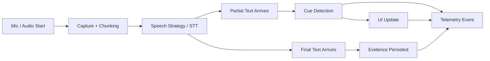
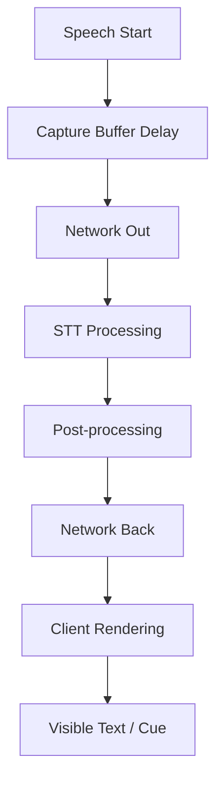

# Road to Sale Audio Telemetry

## Purpose

This document defines what we should measure in the `Road to Sale by AuditPro` audio system.

It is intentionally diagram-first and table-first.

Related docs:
- `docs/ROAD_TO_SALE_AUDIO_ARCHITECTURE.md`
- `dev/docs/ROAD_TO_SALE_AUDIO_LEARNINGS.md`

Last updated:
- `2026-05-22`

Primary external source:
- Gladia: `Real-time latency for meeting transcription: latency budgets and live note-taking requirements`
- URL: https://www.gladia.io/blog/meeting-transcription-latency-live-notes
- Source publication date: `2026-04-17`
- Incorporated into our telemetry thinking: `2026-05-22`

## Telemetry Goal

We need telemetry that tells us:

- where latency is coming from
- which speech strategy performs better
- whether the rep-facing experience feels live enough
- whether cue detection is reliable enough for audit use
- where false positives, false negatives, and manual overrides are happening

## System Measurement Map

## Latency Budget Map

## Layer-by-Layer Expectations

| Layer | What it does | What to measure | Target / expectation | Why it matters |
|---|---|---|---|---|
| Audio capture | Starts mic, buffers frames, chunks audio | `capture_start_ms`, `chunk_duration_ms`, `buffer_delay_ms` | Small, stable chunking | Slow capture ruins everything downstream |
| Network out | Sends audio to provider when needed | `network_out_rtt_ms`, `region` | Keep near user/provider region | Network can eat the latency budget |
| STT processing | Produces partial and final text | `time_to_first_partial_ms`, `time_to_final_ms` | Partial under live threshold; final can be slower | Live UX and evidence have different needs |
| Post-processing | Punctuation, normalization, cleanup | `post_process_ms` | Keep low in live path | Nice-to-have enrichment should not block live cues |
| Cue detection | Maps transcript to workflow cue | `time_to_cue_detection_ms`, `cue_confidence` | Fast enough for rep guidance | This is the product’s core behavior |
| UI rendering | Shows snippet / flips green-red | `time_to_ui_update_ms` | Should feel nearly immediate after cue | Users judge the full experience, not just STT speed |
| Evidence persistence | Stores transcript and event context | `evidence_write_ms`, `event_link_success` | Reliable over fast | Audit trust depends on this layer |

## End-to-End Metrics

| Metric | Definition | Start point | End point | Why it matters |
|---|---|---|---|---|
| `TTFT` | Time to first transcript token | Speech start or VAD trigger | First partial text received | Tells us if live text is fast enough |
| `TTFC` | Time to first cue | Speech start or cue phrase start | Cue detected by app | Best metric for rep-facing usefulness |
| `TTFU` | Time to first UI update | Speech start or cue phrase start | Green/red change visible | What the rep actually feels |
| `TTFinal` | Time to stable final text | Speech start | Final transcript segment stored | Audit/evidence metric |
| `OverrideRate` | Percent of cue decisions changed manually | Cue evaluation | Override action | Detects low trust or weak cue logic |
| `FalsePositiveRate` | Wrong cue fired | Cue evaluation | Later review or manual correction | Critical for audit credibility |
| `FalseNegativeRate` | Expected cue missed | Expected cue window | Later review or audit | Critical for coaching usefulness |

## Expected Ranges

These are working expectations, not guarantees.

| Metric | Good | Watch | Bad |
|---|---|---|---|
| `TTFT` | `<300 ms` | `300-500 ms` | `>500 ms` |
| `TTFC` | `<500 ms` | `500-800 ms` | `>800 ms` |
| `TTFU` | `<650 ms` | `650-1000 ms` | `>1000 ms` |
| `TTFinal` | `<2000 ms` | `2000-4000 ms` | `>4000 ms` |
| `OverrideRate` | `<10%` | `10-20%` | `>20%` |
| `FalsePositiveRate` | `<2%` | `2-5%` | `>5%` |
| `FalseNegativeRate` | `<5%` | `5-10%` | `>10%` |

## What To Measure At Each Stage

| Stage | Event name | Required fields |
|---|---|---|
| Session starts | `audio_session_started` | `session_id`, `deal_id`, `rep_id`, `platform`, `device_model`, `os_version`, `audio_capture_strategy`, `transcription_strategy`, `cue_detection_strategy` |
| Capture begins | `audio_capture_started` | `session_id`, `timestamp`, `sample_rate`, `chunk_size_ms`, `vad_enabled` |
| First speech detected | `speech_started` | `session_id`, `timestamp`, `step_id`, `vad_confidence` |
| First partial received | `partial_text_received` | `session_id`, `timestamp`, `step_id`, `partial_text`, `latency_ms`, `speaker`, `engine_metadata` |
| Final text received | `final_text_received` | `session_id`, `timestamp`, `step_id`, `final_text`, `latency_ms`, `speaker`, `engine_metadata` |
| Cue detected | `cue_detected` | `session_id`, `timestamp`, `step_id`, `cue_id`, `matched_text`, `confidence`, `time_to_cue_detection_ms` |
| UI changed | `cue_ui_updated` | `session_id`, `timestamp`, `step_id`, `cue_id`, `state`, `time_to_ui_update_ms` |
| Manual override | `cue_override` | `session_id`, `timestamp`, `step_id`, `cue_id`, `override_direction`, `user_role` |
| Evidence saved | `evidence_persisted` | `session_id`, `timestamp`, `step_id`, `cue_id`, `transcript_segment_id`, `write_time_ms` |
| Session ends | `audio_session_ended` | `session_id`, `timestamp`, `duration_ms`, `drop_count`, `error_count` |

## What To Slice By

| Dimension | Why we need it |
|---|---|
| `platform` | iOS and Android may behave differently |
| `device_model` | Speech performance may differ significantly by device |
| `os_version` | Platform APIs evolve quickly |
| `transcription_strategy` | Core comparison axis |
| `audio_capture_strategy` | Helps isolate capture-related issues |
| `cue_detection_strategy` | Needed when moving from deterministic-only to hybrid logic |
| `dealer_id` | Environment and usage patterns may differ by store |
| `rep_id` | Helps spot adoption and behavior differences |
| `step_id` | Some Road to Sale steps are inherently easier than others |
| `cue_id` | Some cues will be stronger than others |
| `noise_profile` | Needed for structured testing and later field correlation |

## Strategy Comparison Table

| Question | Telemetry fields to inspect | Decision outcome |
|---|---|---|
| Is iOS native better than Argmax on recent iPhones? | `platform`, `device_model`, `transcription_strategy`, `TTFT`, `TTFC`, `FalsePositiveRate`, `OverrideRate` | Pick iOS default |
| Is one Android strategy too slow on mid-range devices? | `platform`, `device_model`, `transcription_strategy`, `TTFT`, `TTFU`, `error_count` | Drop or limit that strategy |
| Are false positives caused by STT or cue logic? | `transcription_strategy`, `cue_detection_strategy`, `matched_text`, `FalsePositiveRate` | Fix cue pack vs replace STT |
| Are reps fighting the system? | `OverrideRate`, `manual_override_direction`, `step_id`, `cue_id` | Improve trust or UX |
| Are some cues inherently weak? | `cue_id`, `FalseNegativeRate`, `TTFC` | Rewrite or narrow cue pack |

## Minimum Dashboard Views For Engineering

| View | Purpose |
|---|---|
| Latency by layer | Find whether capture, network, STT, or UI is the bottleneck |
| TTFT / TTFC distribution | Show P50, P95, P99 behavior |
| Accuracy by cue | Find weak cues fast |
| Override heatmap by step | Find where reps stop trusting the system |
| Strategy comparison by platform/device | Choose defaults based on evidence |
| Error and dropout trend | Catch session stability problems |

## P50 / P95 / P99 Rule

Do not rely on averages alone.

| Percentile | Why it matters |
|---|---|
| `P50` | Typical user experience |
| `P95` | Early warning on tail latency |
| `P99` | Worst-case behavior that breaks trust |

If `P50` looks good but `P99` is terrible, the product will still feel unreliable.

## What Not To Do

| Bad practice | Why it fails |
|---|---|
| Measure only provider inference time | Hides capture, network, and UI delay |
| Track only averages | Masks bad tail behavior |
| Ignore overrides | Misses trust failures |
| Skip platform/device dimensions | Prevents real strategy comparisons |
| Mix live and final metrics together | Blurs rep UX and audit evidence needs |

## Recommended First Instrumentation Pass

| Priority | Instrument first |
|---|---|
| 1 | `audio_session_started` |
| 2 | `speech_started` |
| 3 | `partial_text_received` |
| 4 | `cue_detected` |
| 5 | `cue_ui_updated` |
| 6 | `final_text_received` |
| 7 | `cue_override` |
| 8 | `evidence_persisted` |

## Update Rule

When this document is updated:
- keep source publication dates
- add incorporation dates for new learnings
- update threshold tables only with evidence
- note when platform strategy defaults change because of telemetry
