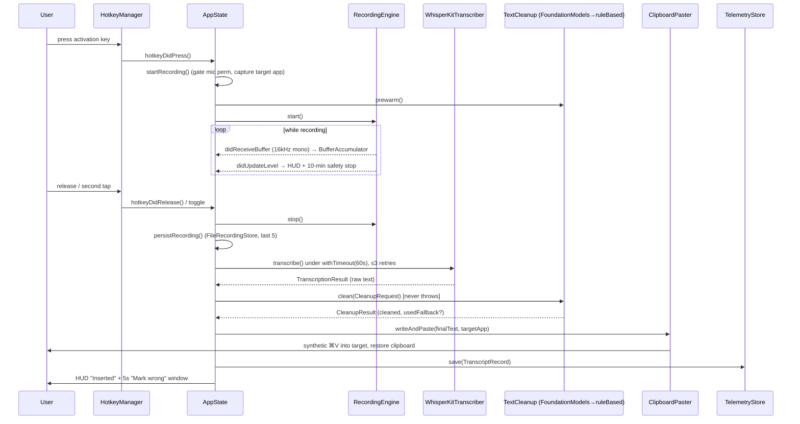

# Just Talk — End-to-End Flows

> **Module docs:** [architecture.md](architecture.md) · [api.md](api.md) · [flows.md](flows.md) (this file)
> **Related deep-dive:** [macos-input-paste-audit.md](macos-input-paste-audit.md) (the hotkey/paste subsystem)

These are the real code paths, with the files and methods involved. The macOS flow is
the shipping product; the iOS flow is code-complete but paused (see
[architecture.md](architecture.md)).

---

## Flow 1 — macOS dictation: hotkey → record → transcribe → clean → paste

The main flow. All orchestration lives in `JustTalk/AppState.swift` unless noted.

### Sequence

1. **Key press.** `HotkeyManager` (`JustTalk/HotkeyManager.swift`), pumped on its dedicated
   tap thread, sees the configured activation key (`CGEventTap` at `.cghidEventTap`, matched by
   `HotkeyConfig.match`). A press/release edge fires `hotkeyDidPress()` / `hotkeyDidRelease()`
   on the main queue. Suppressing keys (Fn / F-keys) are swallowed; real modifiers pass through.
2. **Mode → record.** `AppState.hotkeyDidPress()` routes by `HotkeyMode`:
   `hold` → `startRecording()`; `toggle` → `toggleRecording()` (start, then stop on the next tap).
3. **`startRecording()`:**
   - Gates on `dictationState == .idle && engineLoaded`, and on **mic permission** (never
     starts the audio engine without it — that was the "mic prompt on every key press" bug).
   - Resets the `BufferAccumulator`, records the start time, captures the **frontmost app**
     (`NSWorkspace.frontmostApplication`) as the paste target.
   - Calls `cleanup.prewarm()` — warms the on-device LLM *while the user talks* (~355 ms warm
     vs ~1.3 s cold).
   - `recordingEngine.start()` (`DictationCore/RecordingEngine.swift`) installs the audio tap.
   - Shows the `RecordingHUD` ("Listening…") and starts the live-preview loop.
4. **Audio capture.** `RecordingEngine` converts each native buffer to 16 kHz mono Float32 and
   calls back on the audio thread:
   - `recordingEngine(_:didReceiveBuffer:)` → `audio.append(buffer)` **synchronously on the
     audio thread** (order-preserving — this is what fixed long recordings scrambling).
   - `recordingEngine(_:didUpdateLevel:)` → updates the HUD meter and the "too quiet" warning,
     and enforces the **10-minute hard safety stop**.
   - Silence detection is wired but intentionally does **not** auto-stop.
   - Meanwhile `runPreview()` transcribes the last 30 s with the tiny `tinyEn` model every
     ~1.2 s for the HUD preview only (never the paste path).
5. **Key release / second tap → stop.** `stopRecordingAndTranscribe()` stops the engine,
   cancels the preview, sets state `.transcribing`, snapshots the buffers, **persists the raw
   audio** (`persistRecording` → `FileRecordingStore`, last 5 kept), and launches
   `performTranscription`.
6. **Transcription** (`performTranscription` → `transcribeWithRetry`):
   - `withTimeout(60s)` wraps `transcriber.transcribe(buffers:audioStartDate:)`. Up to 3
     attempts on transient failure; `emptyResult`/`noAudioData` are rethrown immediately
     (no point retrying silence); a `TimeoutError` fails fast.
   - `WhisperKitTranscriber` flattens buffers, rejects silence/quiet/hallucinated output, and
     returns a `TranscriptionResult`.
7. **Cleanup:**
   - The effective `CleanupLevel` is resolved against the record-start app
     (`effectiveLevel(forBundleId:)` — per-app overrides, e.g. Off in a terminal).
   - If level ≠ `.off` and word count ≥ `pack.minWordsForCleanup`, `cleanup.clean(CleanupRequest)`
     runs. `FoundationModelsCleanup` calls the on-device model under a length-scaled timeout,
     runs the output through `CleanupOutputSanitizer`, and applies the deterministic
     command/vocab/lexicon post-pass. **It never throws** — any failure falls back to
     `RuleBasedCleanup` with `usedFallback = true`.
   - `finalText = cleanupResult?.cleanedText ?? rawText`.
8. **Paste** (`ClipboardPaster.writeAndPaste`, `JustTalk/ClipboardPaster.swift`):
   - Snapshots the user's clipboard, writes `finalText`, re-activates the target app, and
     `pasteWhenFocused` polls until the target is frontmost (up to ~0.6 s) before posting a
     **tagged** synthetic ⌘V (the tag stops the hotkey tap from self-triggering).
   - 700 ms later it **restores the user's prior clipboard** (guarded so newer copies /
     back-to-back dictations aren't clobbered). If the target never becomes frontmost it
     refuses to paste and leaves the text on the clipboard, surfacing "couldn't paste".
9. **Telemetry + correction window:**
   - Builds a `TranscriptRecord` (raw + final text, confidence, latency, model tier, frontmost
     app, cleanup level/provider) and `telemetryStore.save(record)`.
   - Opens a 5-second **correction window**; the HUD shows "Inserted" with a **"Mark wrong"**
     button → `markLastTranscriptCorrected()` → `telemetryStore.markCorrected`.
   - State → `.idle`, status → ready.

### Diagram

---

## Flow 2 — Timeout & resource release

A stuck model call must never hang the app or leave orphaned work holding resources.

1. `withTimeout(seconds:)` (`DictationCore/Timeout.swift`) races the operation against a timer
   as **independent unstructured tasks**. At the deadline the caller is freed even if the
   operation ignores cancellation; the stuck task is abandoned (OS reclaims it).
2. **Transcription timeout** — `performTranscription` catches `TimeoutError` →
   `recoverAfterTimeout()`: `transcriber.reset()` + `cleanup.reset()` drop the (possibly stuck)
   model/session, `engineLoaded = false`, then the transcriber is reloaded fresh in the
   background. The audio is preserved and a **Retry** affordance is shown.
3. **Cleanup timeout** — `FoundationModelsCleanup.clean` wraps the LLM call in
   `withTimeout(responseTimeout(wordCount:))` (15 s floor → 90 s ceiling, ~50 ms/word). On
   timeout it `reset()`s the held session and returns the rule-based result with
   `usedFallback = true` — paste still happens.
4. **Failure preservation** — `failWithRetry` keeps the audio in `pendingAudio` and shows the
   HUD's Retry / dismiss buttons (`retryPendingDictation` / `discardPendingDictation`), so a
   dictation is never silently lost.

---

## Flow 3 — Re-transcribe a saved recording

Recovers a junk/failed dictation without re-speaking.

1. Menu action → `AppState.reTranscribeLastRecording()`.
2. `recordingStore.recent().first` → `loadSamples(id:)` (off the main actor) →
   `AudioSampleBridge.makeBuffer(...)`.
3. Re-enters `performTranscription` with the loaded buffer — same clean/paste/telemetry path as
   Flow 1.

---

## Flow 4 — Startup, permissions & model load

1. `JustTalkApp` (`@main`) creates `AppState`; `AppState.init` reads persisted settings and
   builds the transcriber + cleanup from config, then kicks off `setup()`.
2. `setup()`:
   - `refreshPermissions()` reads **non-prompting** status (mic, Accessibility, Input
     Monitoring) via `PermissionsService`.
   - Builds `HotkeyManager`; installs the event tap only once both tap permissions are present.
   - Starts a 1.2 s permission poll + `didBecomeActive` observer so the wizard's ticks update
     live.
   - Shows the onboarding wizard (`OnboardingView`/`OnboardingWindow`) on first launch or when
     a required permission is missing.
   - `transcriber.load(onProgress:)` downloads (first run) and loads the WhisperKit model,
     streaming progress to the status line.
   - Opens `TelemetryStore`, runs the **30-day privacy purge**, and loads recent transcripts.
   - Loads the tiny live-preview model in the background.
3. The wizard's "press your key to test" step routes a press to
   `hotkeyDidReceiveConfiguredKey()` only (`HotkeyManager.isTesting`) to prove the key reaches
   the app — the definitive hotkey-conflict check.

---

## Flow 5 — iOS keyboard (high level, paused)

Mirrors Flow 1 with the keyboard's constraints. Driven by `KeyboardViewModel` (the full
implementation is in git history; current files on this branch are diagnostic stubs).

1. The user enables the **Dictation** keyboard and grants **Allow Full Access** (microphone),
   then switches to it in any app.
2. `KeyboardViewModel.init` loads the cleanup pack and builds the cleanup engine; `setup()`
   requests mic permission, loads the **`tinyEn`** WhisperKit tier (~40 MB, fits the
   extension's memory budget), and opens the App Group `TelemetryStore`.
3. **Tap the mic** → `toggleRecording()` → `startRecording()`: `RecordingEngine.start()` (iOS
   `AVAudioSession` path), state `.recording`.
4. Buffers accumulate via the `RecordingEngineDelegate`.
5. **Tap again** → `stopRecordingAndTranscribe()` → `performTranscription`:
   - `transcriber.transcribe(...)` → raw text.
   - Same `TextCleanup` contract + cleanup pack as macOS (Foundation Models with rule-based
     fallback) — every macOS cleanup fix is inherited for free.
   - Insert the cleaned text via the controller's `insertTextCallback` (writes through
     `textDocumentProxy`) — **no clipboard/paste**, unlike macOS.
   - Save a `TranscriptRecord` with `platform: "ios"`.
6. `markLastCorrected()` flags the most recent record on correction.

### Key macOS-vs-iOS differences

| Aspect | macOS (`AppState`) | iOS (`KeyboardViewModel`) |
|--------|--------------------|---------------------------|
| Trigger | Global hotkey (`CGEventTap`) | In-keyboard mic button |
| Output | Synthetic ⌘V paste + clipboard restore | `textDocumentProxy` insert |
| STT tier | `largeV3Turbo` (multilingual) | `tinyEn` (memory budget) |
| Telemetry DB | App Support SQLite | App Group SQLite |
| Cleanup | Same contract + pack | Same contract + pack |
| Status | Shipping | Code-complete, paused on signing |
