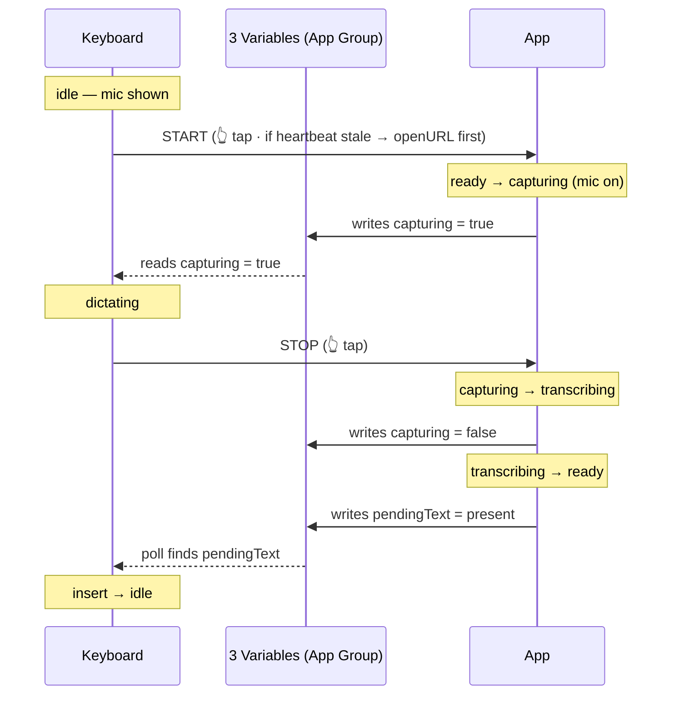

# iOS dictation architecture — Just Talk keyboard ⇄ app

How the Just Talk **keyboard** and **container app** cooperate to dictate on iOS. This is the
authoritative model; the code is expected to match the swim-lane below. A rendered visual version
lives alongside at [`ios-dictation-architecture.html`](./ios-dictation-architecture.html).

---

## The hard constraints (these dictate the whole design)

1. A **keyboard extension cannot access the microphone** (iOS sandbox). Only the container app can record.
2. Keyboard and app are **separate processes / sandboxes** — no shared memory. They coordinate only via
   an **App Group** (shared `UserDefaults`) and **Darwin notifications**.
3. iOS **destroys and recreates the keyboard extension** when the user leaves and returns to the host
   app. The keyboard has **no durable in-memory state**.
4. iOS **suspends/kills backgrounded apps**, and a keyboard **cannot launch an app into the background**
   (only foreground, via `openURL`).

## What actually runs — two processes only

| | Process | What lives in it |
|---|---|---|
| **1** | `DictationKeyboard.appex` (extension) | `KeyboardViewController`, `KeyboardViewModel` (thin UI, **no durable state**), plus a compiled-in copy of `DictationHandoff`. |
| **2** | `DictationContainerApp` (app) | `RecordSessionModel` (the Flow Session), `FlowSessionAudio` (the one `AVAudioEngine`), plus a compiled-in copy of `DictationHandoff`. |

- **`DictationHandoff`** is not a process — it's a Swift `enum` of static functions in the shared
  `DictationCoreBase` package. Both binaries link it, so each carries its **own compiled copy of the
  code**. The **data** it manages lives once, on disk, in the App Group container.
- **`FlowSessionAudio`** runs **only inside Process 2**. It owns the single `AVAudioEngine` (silent
  keep-alive + mic tap). The keyboard never touches it.

## "Darwin" — what it means

**Darwin** is the open-source Unix/Mach core under macOS & iOS. A *Darwin notification*
(`CFNotificationCenterGetDarwinNotifyCenter`) is the OS-level **cross-process signal bus** — the one
lightweight way two sandboxed processes can poke each other. It **carries no payload**, just a name.
That is *why* the App Group variables exist: the Darwin signal is the doorbell; the variables are what
you read when it rings.

---

## The model: 3 variables + 2 signals

Everything is a state machine over **three App Group variables**, with strict one-way ownership:

| Variable | Type | Writer | Reader | Meaning |
|---|---|---|---|---|
| `heartbeat` | timestamp | **App** (3s timer) | Keyboard | App alive? Fresh (<8s) → signal it. Stale → relaunch it. |
| `capturing` | bool | **App** | Keyboard | Dictation in progress? Decides start-vs-stop; re-syncs the keyboard after iOS recreates it. |
| `pendingText` | string+ts | **App** | Keyboard | Finished transcript. Keyboard polls, consumes (one-shot), inserts. |

*(`level` — a float mic loudness for a future waveform — also crosses the App Group but isn't a
control variable.)*

**Directional split (the invariant that removes the races):**

- **App → variables:** the app is the **sole writer**. The three variables *are* the app's state, on disk.
- **variables → keyboard:** the keyboard is the **sole reader**. Its own state is *derived* from them.
- **keyboard → app:** two Darwin signals only — **`START`** and **`STOP`**.

No variable is ever written by both sides. `openURL` is **not** a third signal — it's just how a
`START` resolves when `heartbeat` is stale (the app must be launched first).

## State names

| Object | State | Meaning |
|---|---|---|
| **App** (`RecordSessionModel.Phase`) | `warming` | Launched, loading model, not yet holding audio. |
| | `ready` | Warm & alive, engine silent, waiting. |
| | `capturing` | Mic tap on (same name as the `capturing` variable, on purpose). |
| | `transcribing` | Audio → text. |
| **Keyboard** (`KeyboardDictationState`) | `idle` | Not dictating. "Tap mic". |
| | `dictating` | A dictation is live. "tap to stop". |
| | `awaiting` | Stop pressed; polling for the text. |

> **Note:** `ready` and `transcribing` write identical variable values (`fresh / false / empty`), so the
> keyboard can't distinguish them from the App Group alone — `awaiting` is therefore a **local** keyboard
> state (it knows *it* just posted `STOP`). Edge effect: if iOS recreates the keyboard mid-transcribe it
> shows `idle` not `awaiting` — harmless (it still inserts when `pendingText` lands).

## Heartbeat is liveness — orthogonal to phase

`heartbeat` is written by a **separate 3-second timer** that runs the entire time the app process is
alive — identically in `ready`, `capturing`, **and** `transcribing`. It never pauses for transcription.
Its only meaning: **is this process alive?** Fresh ⟺ alive; stale (>8s) ⟺ iOS killed it. The keyboard
reads it **only** when deciding a *new* tap → signal vs relaunch; never mid-dictation. *Coupling to
watch: the heartbeat loop must never share a thread a long transcribe can block.*

---

## The flow (swim-lane)

Keyboard sends signals; the app writes the variables; the keyboard reads them back.

## Keep-alive (why there's no repeat app-switch)

`FlowSessionAudio` is **one** `AVAudioEngine` that starts once and runs continuously, looping **silent
audio** so iOS keeps the app resident (`UIBackgroundModes: audio`) with **no mic held** between
dictations (no orange indicator). A dictation just **installs/removes a mic tap** — no engine restart.
This is what lets the app stay warm all day: only the *first* dictation after an iOS kill / reboot cold-
launches (one `openURL`); every later one takes the seamless `START` path. *(Two separate engines fought
one session and threw `'what'` 2003329396 after a cold relaunch — hence the single-engine design.)*

## Race conditions fixed (history)

| Bug | Root cause | Fix / invariant |
|---|---|---|
| 2nd tap *started* not *stopped* | keyboard tracked recording in local (recreated) state | start/stop decided **only** from `capturing` in the App Group |
| stuck "Transcribing", no paste | cross-process `UserDefaults` cache staleness | `synchronize()` on every transcript write + read |
| text vanished, keyboard stuck | a stale keyboard instance's `done` observer inserted into a dead proxy | removed the `done` observer; **only the visible instance polls + inserts** |
| mic dead after cold relaunch (`'what'`) | two `AVAudioEngine`s fighting one session | one engine, starts once, capture = add/remove a tap |
