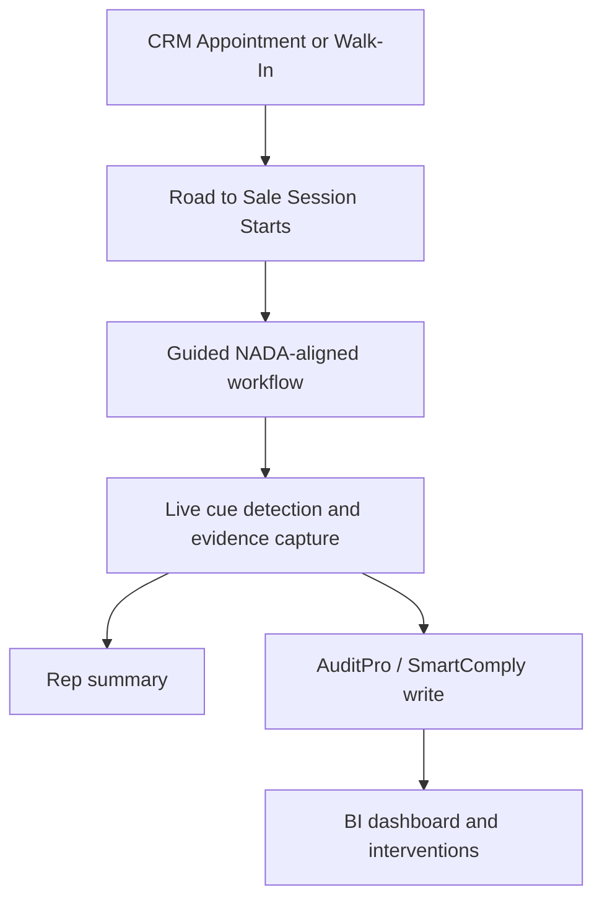

# Road to Sale by AuditPro PRD

## Purpose

This document defines the functional product requirements for `Road to Sale by AuditPro`.

Last updated:
- `2026-05-22`

Related docs:
- `docs/ROAD_TO_SALE_TECHNICAL_ARCHITECTURE.md`
- `docs/ROAD_TO_SALE_AUDIO_ARCHITECTURE.md`
- `dev/docs/ROAD_TO_SALE_HANDOFF.md`

## Product Summary

`Road to Sale by AuditPro` is a mobile-first dealership sales-floor coaching and audit product for the U.S. market.

It guides the salesperson through a NADA-aligned Road to the Sale workflow while capturing structured audit evidence, misses, coaching opportunities, and BI (business intelligence) signals. NADA is the National Automobile Dealers Association.

It should build on top of the existing `AuditPro / SmartComply` backend model, not bypass it.

## Product Goals

| Goal | Description |
|---|---|
| Rep guidance | Help the salesperson know what to do next with low friction |
| Audit evidence | Capture what was done, missed, or overridden |
| Coaching | Convert misses into rep and manager coaching signals |
| AuditPro compatibility | Keep Road to Sale structurally compliant with the parent audit platform |
| BI feed | Supply clean event and evidence data into the dashboard and intervention workflows |

## Non-Goals

| Non-goal | Why |
|---|---|
| Replace dealership CRM | CRM remains upstream |
| Replace DMS | Not product scope |
| Perfect verbatim transcription | Intent capture and evidence quality matter more |
| Fully autonomous sales AI | Product assists and audits the rep |

## Primary Users

| User | Needs |
|---|---|
| Salesperson | Guidance, progress visibility, feature coaching, easy workflow |
| Sales manager | Misses, compliance, coaching priorities, intervention tracking |
| Dealer principal | Roll-up view of execution and gaps |
| OEM / audit stakeholders later | Compatibility with AuditPro-style audit records |

## Product Positioning

| Product | Role |
|---|---|
| AuditPro / SmartComply | Parent audit and compliance platform |
| Road to Sale | Sales-floor workflow and audit product built on top of AuditPro |

Important platform rule:
- `AuditPro` can exist by itself
- `Road to Sale` assumes `AuditPro / SmartComply`
- `Road to Sale` writes on top of the parent system rather than becoming a disconnected stack

## Core Functional Scope

### 1. Appointment and session start

The product should:
- show CRM-fed appointments
- support a `New Walk-In` path
- create a live session / conversation context
- associate the rep, customer, vehicle shortlist, and store

### 2. NADA-aligned workflow guidance

The product should guide the rep through major steps such as:
- greet
- discovery
- vehicle match
- front-line ready
- walkaround
- test drive
- trade appraisal
- proposal / pencil
- buyer’s order
- F&I handoff
- completion summary

### 3. Live audio-assisted cue capture

The product should:
- listen during an active session
- detect high-value cues and feature mentions
- mark completed items green
- leave missed items red
- show short transcript snippets for trust

### 4. Vehicle-specific feature guidance

The product should:
- load model-specific feature sets
- separate parked features from in-drive features
- detect which features were covered
- suggest what is still missing

### 5. Trade-in capture and condition support

The product should:
- capture required trade photos
- identify obvious visual condition signals
- combine photo findings with spoken trade notes

### 6. Rep summary and coaching

The product should:
- show strengths
- show misses
- give a lightweight self-coaching view

### 7. Manager and BI feed

The product should:
- persist structured events and evidence
- feed dashboard rollups
- support coaching and intervention workflows

## Core Flow

## Functional Requirements

| Area | Requirement |
|---|---|
| Sessioning | A Road to Sale session must map to a canonical audit/session record |
| Workflow | NADA-aligned steps must be represented as structured checklist items |
| Audio | Step-aware cue detection must support rep guidance and evidence capture |
| Override | Manual confirmation / override must exist when confidence is low |
| Evidence | Cue events, snippets, timestamps, and overrides must be stored |
| Compatibility | Data must map cleanly into AuditPro / SmartComply concepts |
| BI | Events must be consumable by dashboard and intervention layers |

## Conceptual Data Mapping

| Road to Sale concept | AuditPro / SmartComply concept |
|---|---|
| NADA step set / checklist | Audit template / checklist definition |
| Individual sales conversation | Audity / live session instance |
| Step completion / miss | Audit response / event |
| Feature proof / transcript snippet / image | Audit evidence |
| Rep session summary | Audit/session summary |
| Manager intervention | Follow-up workflow / coaching action |

This mapping matters. It keeps Road to Sale aligned with the parent platform rather than creating a parallel data model that becomes painful later.

## Success Metrics

| Metric | Why it matters |
|---|---|
| Rep session usage | Product is only real if reps actually use it |
| Cue detection reliability | Core product trust metric |
| Override rate | Signals confidence or usability issues |
| Step completion by rep | Measures workflow adherence |
| Missed-step trend | Feeds coaching value |
| Manager intervention usage | Measures operational value |

## Key Risks

| Risk | Why it matters |
|---|---|
| Product feels like surveillance | Reps will resist it |
| Audio is brittle | Both guidance and audit trust fall |
| Data model diverges from AuditPro | Integration pain and BI inconsistency |
| Workflow feels heavy | Adoption drops |
| Vehicle content goes stale | Credibility falls |

## MVP Philosophy

The first real build should prove:
- usable rep workflow
- Road to Sale to AuditPro-compatible persistence
- live cue capture
- miss / coaching value
- BI feed potential

It does not need to prove:
- perfect transcript quality
- every possible speech or summary feature
- broad general-purpose conversational intelligence
