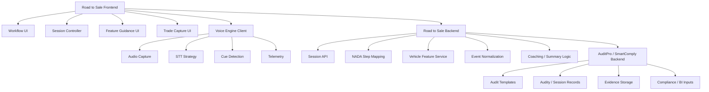

# Road to Sale Technical Architecture

## Purpose

This document defines the high-level technical architecture for `Road to Sale by AuditPro`.

It exists to separate the product into clear pieces so implementation stays organized.

Last updated:
- `2026-05-22`

Related docs:
- `docs/ROAD_TO_SALE_PRD.md`
- `docs/ROAD_TO_SALE_AUDIO_ARCHITECTURE.md`
- `dev/docs/ROAD_TO_SALE_AUDIO_TELEMETRY.md`

## Core Principle

The `Road to Sale` product and the `Voice Engine` should be separate systems.

Reason:
- Road to Sale frontend and backend are NADA-driven product layers
- the voice engine is a reusable technical capability
- AuditPro / SmartComply remains the parent canonical backend

This means we should explicitly separate:
- Road to Sale frontend
- reusable voice engine
- Road to Sale backend
- AuditPro / SmartComply backend

## System Diagram

## Expanded Component View

## Component Responsibilities

### 1. Road to Sale Frontend

Owns:
- rep-facing workflow UI
- step progression
- transcript snippet visibility
- feature completion states
- trade capture
- manual override interactions

Should not own:
- raw STT implementation details
- canonical audit persistence rules

### 2. Reusable Voice Engine

Owns:
- audio capture
- STT strategy selection
- cue detection
- partial/final transcript outputs
- normalized cue events
- telemetry

Should not own:
- NADA business logic
- Road to Sale-only workflow semantics
- BI-specific interpretation

This is the part that should remain reusable across future products.

### 3. Road to Sale Backend

Owns:
- session lifecycle
- NADA step/checklist mapping
- product-specific event interpretation
- vehicle feature content
- coaching summary generation
- translation from Road to Sale events into AuditPro-compatible writes

### 4. AuditPro / SmartComply Backend

Owns:
- parent audit data model
- templates/checklists
- audity-like session records
- evidence persistence
- BI-compatible canonical records

Important rule:
- Road to Sale writes on top of this system
- Road to Sale should not create a disconnected canonical backend of its own

## Separation of Concerns

| Layer | Owns what | Should not own |
|---|---|---|
| Road to Sale frontend | UX, workflow visuals, rep interactions | Speech-engine internals, canonical persistence |
| Voice engine | Audio capture, STT, cue events, telemetry | NADA workflow semantics |
| Road to Sale backend | Product session semantics, NADA mapping, coaching logic | Low-level speech-engine details |
| AuditPro / SmartComply backend | Canonical audit records and evidence | Rep workflow UX |

## Data Flow

| Step | Flow |
|---|---|
| 1 | CRM appointment or walk-in starts a Road to Sale session |
| 2 | Frontend fetches session context from Road to Sale backend |
| 3 | Frontend activates voice engine with step and cue-pack context |
| 4 | Voice engine emits transcript snippets and cue events |
| 5 | Frontend updates rep UI |
| 6 | Voice engine and frontend send normalized events to Road to Sale backend |
| 7 | Road to Sale backend maps them into AuditPro / SmartComply-compatible structures |
| 8 | AuditPro / SmartComply persists session, evidence, and results |
| 9 | BI/dashboard consumes persisted data |

## Mapping To Parent Platform

| Road to Sale artifact | Likely home |
|---|---|
| NADA checklist definition | AuditPro / SmartComply template layer |
| Live sales conversation | AuditPro / SmartComply audity-like session |
| Product session API | Road to Sale backend |
| Vehicle feature service | Road to Sale backend |
| Cue events / transcript snippets | Voice engine -> Road to Sale backend -> AuditPro evidence |
| Coaching summary | Road to Sale backend |
| BI rollups | Parent backend + BI layer |

## Why This Split Matters

Without this split, the codebase will blur:
- a reusable speech stack
- a NADA-specific workflow product
- a parent audit/compliance system

That would make:
- code organization worse
- provider strategy changes harder
- BI integration messier
- reuse of the voice engine much harder

## Recommended Domain Layout

| Domain | Purpose |
|---|---|
| `road-to-sale-app` | Mobile app UI and workflow orchestration |
| `voice-engine` | Reusable speech capture / STT / cue / telemetry layer |
| `road-to-sale-service` | Product backend for sessions, NADA mapping, vehicle content, coaching |
| `auditpro-smartcomply` | Canonical audit backend and BI-compatible storage model |

Exact repo layout may vary. The conceptual separation should not.

## MVP Build Order

1. Define the AuditPro-compatible checklist and session mapping.
2. Define the normalized event schema between voice engine and Road to Sale backend.
3. Build the Road to Sale workflow shell.
4. Build the reusable voice engine.
5. Build the Road to Sale backend.
6. Persist into the AuditPro / SmartComply model.
7. Feed BI/dashboard views.

## Design Rules

| Rule | Meaning |
|---|---|
| Keep Road to Sale and voice engine separate | Do not bury speech logic inside the workflow screens |
| Keep Road to Sale backend and AuditPro backend conceptually separate | Product logic is not canonical audit storage |
| Make Road to Sale writes AuditPro-compatible | Preserve parent platform alignment |
| Keep the voice engine reusable | It should support future products |
| Use normalized interfaces | Prevent vendor and frontend/backend lock-in |
