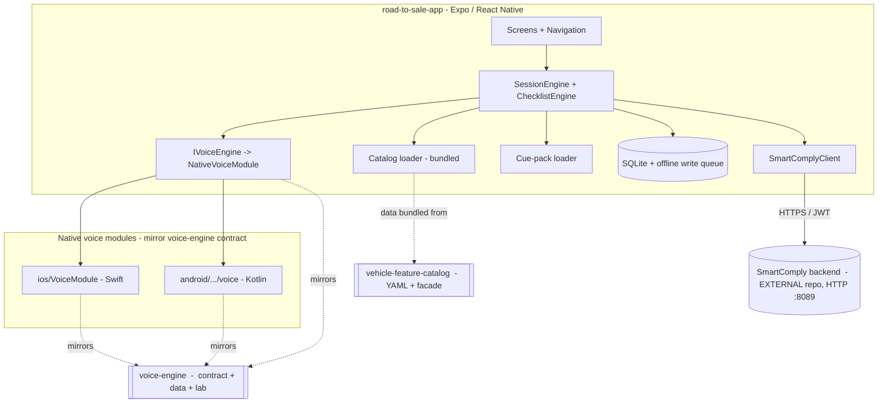
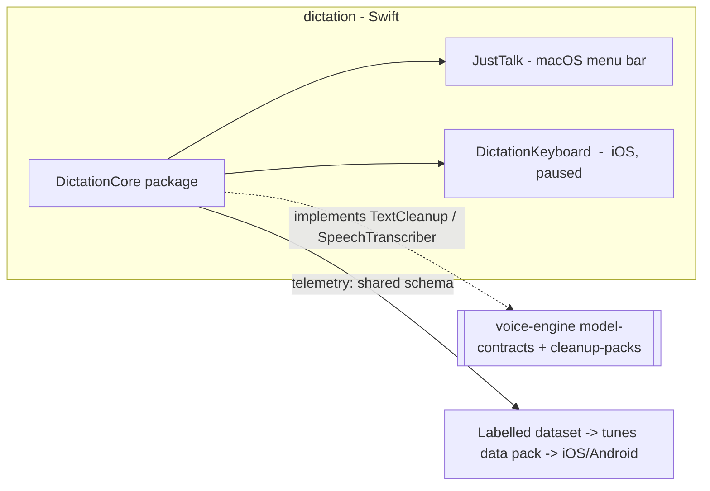

# System Architecture — Road to Sale (monorepo)

This is the **whole-system** architecture for the `roadtosale` monorepo. It describes
every module in the repo, what each is, how they relate, and where the boundaries lie —
including the one major dependency that no longer lives in this repo (the SmartComply
backend). For deep dives into any single module, follow the cross-links; this document
is the map, not the territory.

> New here? Read this file top to bottom, then jump to the module doc for whatever you're
> working on. Every module also has its own `docs/{api,architecture,flows}.md`.

---

## 1. What this repo is

Road to Sale by AuditPro is a NADA-aligned dealership sales-floor coaching and audit
product. A sales rep walks a customer through a vehicle; a voice engine listens, detects
workflow steps and feature demonstrations in real time, and builds an audit trail that is
written into the parent **AuditPro / SmartComply** compliance platform.

The repo also hosts a second, independent product — **JustTalk**, a macOS dictation app —
which shares no runtime code with Road to Sale but **shares the voice cleanup contract and
data**. JustTalk is the daily-driver dogfood that produces the labelled data and learnings
that tune cleanup for the Road to Sale mobile apps. That shared spine is the reason both
products live in one repo.

The product/PRD vision and the original layered split are captured in the deeper-dive
references kept in this folder:

- [`ROAD_TO_SALE_PRD.md`](ROAD_TO_SALE_PRD.md) — functional product requirements.
- [`ROAD_TO_SALE_TECHNICAL_ARCHITECTURE.md`](ROAD_TO_SALE_TECHNICAL_ARCHITECTURE.md) —
  the conceptual frontend / voice-engine / backend / parent-platform split.
- [`ROAD_TO_SALE_AUDIO_ARCHITECTURE.md`](ROAD_TO_SALE_AUDIO_ARCHITECTURE.md) — the audio
  subsystem deep-dive (two-lane live + evidence strategy, STT vendor choices, latency
  budgets). **For anything about the audio/STT subsystem, read this.**

These three are conceptual/vision docs. This file reflects the **code as it stands today**.

---

## 2. Module map

| Module | What it is | Language(s) | Deployable? | Module docs |
|---|---|---|---|---|
| [`voice-engine/`](../voice-engine/) | **Contract, data, and research core** for speech-to-text + cue matching + cleanup. NOT a library the apps link — it is the canonical spec + data + Python lab. | Python (lab), TypeScript (reference skeleton) | No — it is a spec/data/research core | [`architecture.md`](../voice-engine/docs/architecture.md) · [`api.md`](../voice-engine/docs/api.md) · [`flows.md`](../voice-engine/docs/flows.md) · [`model-contracts.md`](../voice-engine/docs/model-contracts.md) |
| [`vehicle-feature-catalog/`](../vehicle-feature-catalog/) | Brand-extensible catalog of Makes/Models/Trims/Features and the sparse trim×feature matrix. Single source of truth for what features exist on a trim. | Python + TypeScript (twin facades) | No — consumed as data/package | [`architecture.md`](../vehicle-feature-catalog/docs/architecture.md) · [`api.md`](../vehicle-feature-catalog/docs/api.md) · [`flows.md`](../vehicle-feature-catalog/docs/flows.md) |
| [`road-to-sale-app/`](../road-to-sale-app/) | The Road to Sale mobile app — Expo / React Native, with native iOS (Swift) + Android (Kotlin) voice modules. Talks to SmartComply over HTTP. | TypeScript + Swift + Kotlin | **Yes** — iOS + Android app | [`smartcomply-contract.md`](../road-to-sale-app/docs/smartcomply-contract.md) |
| [`dictation/`](../dictation/) | **JustTalk** — a macOS menu-bar dictation app (Wispr Flow replacement) + a paused iOS keyboard extension. Shares the `DictationCore` Swift package. | Swift (DictationCore package + apps) | **Yes** — macOS app (iOS keyboard paused) | [`architecture.md`](../dictation/docs/architecture.md) |
| **SmartComply backend** | The AuditPro / SmartComply Java/Spring compliance backend. **External — lives in its own repo now.** Road to Sale integrates with it over HTTP at `:8089`. | Java / Spring | External dependency | [contract](../road-to-sale-app/docs/smartcomply-contract.md) (consumer-side) |
| [`demo/`](../demo/) | Outreach / showcase material only. **Not product code.** Do not import from it. | mixed | No | — |

Support directories: [`dev/`](../dev/) holds development-only material (PRDs, task lists,
decisions log, CI/CD playbook — never shipped); [`scripts/`](../scripts/) holds repo-wide
tooling such as `check_imports.py` (the CI boundary guard); [`data/`](../data/) is
runtime/transient (gitignored).

---

## 3. The key insight: voice-engine is a contract core, not a linked library

This is the single most important thing to understand about the repo, and the easiest to
get wrong.

`voice-engine/` is **not** a library that the apps depend on at runtime. Nothing in this
repo `import`s the TypeScript package in `voice-engine/src/`. Instead, `voice-engine` is
three things:

1. **The canonical contract** — language-neutral definitions of the swappable model layers
   (STT and cleanup), in [`voice-engine/docs/model-contracts.md`](../voice-engine/docs/model-contracts.md)
   and sketched in the TS skeleton under `voice-engine/src/`.
2. **The canonical data** — the cleanup data packs in
   [`voice-engine/cleanup-packs/`](../voice-engine/cleanup-packs/) (`dictation.json`,
   `road-to-sale.json`: prompts, filler lists, command grammar, vocab, junk phrases) and
   the shared telemetry schema.
3. **The research lab** — `voice-engine/lab/` (Python) is the **real, working** offline
   comparison harness that benchmarks STT strategies (Apple SpeechTranscriber, WhisperKit,
   sherpa-onnx, Argmax, mock) on recorded fixtures and produces the evidence behind every
   STT vendor choice.

> **Reuse principle: code does not port — contracts, data, and learnings do.**

Each shipping product **re-implements the same contract natively**:

| Product | STT impl | Cleanup impl | Fallback |
|---|---|---|---|
| `dictation/` (macOS) | WhisperKit (via `DictationCore`) | Apple Foundation Models | rule-based |
| `road-to-sale-app/ios` | Apple SpeechTranscriber / WhisperKit | Foundation Models (iOS 26+) | rule-based |
| `road-to-sale-app/android` | Argmax / sherpa-onnx | Gemini Nano / MediaPipe | rule-based |

Each cell is a different implementation of the **same** contract. Because the data pack and
telemetry schema are shared, the macOS dogfood's cleanup learnings tune all three platforms.

The TS `voice-engine/src/` exists only as a **reference skeleton** (only the `mock` strategy
actually runs) — it documents the shape the native code mirrors. Former empty `voice-engine/ios/`
and `voice-engine/android/` placeholder modules, a throwing TS strategy, and `WhisperKitLiveSTT`
were **removed** precisely because they implied a linkage that does not exist. See the banner at
the top of [`voice-engine/README.md`](../voice-engine/README.md).

`scripts/check_imports.py` enforces in CI that `voice-engine` and `vehicle-feature-catalog`
never import each other.

---

## 4. How the modules relate (Road to Sale product)

- The app's `src/voice/IVoiceEngine.ts` is the JS-side facade; `NativeVoiceModule` bridges
  to the Swift (`road-to-sale-app/ios/VoiceModule/`) and Kotlin
  (`road-to-sale-app/android/.../voice/`) modules. Those native modules implement the
  `voice-engine` STT/cleanup contract — they do not import the TS package.
- The vehicle catalog is **bundled** into the app as data (`road-to-sale-app/src/catalog/`,
  built from the `vehicle-feature-catalog` package); the app projects `Feature → CueAtom`
  for the cue matcher.
- All canonical persistence goes to the external **SmartComply backend** over HTTP via
  `SmartComplyClient`, with a SQLite-backed offline write queue in between.

### The SmartComply boundary

SmartComply (AuditPro) is the parent audit/compliance platform. Its source **was deleted
from this repo and now lives in a separate repository.** Road to Sale still integrates with
it, strictly over HTTP:

- Base URL: `http://localhost:8089` for local dev (`SMARTCOMPLY_API_URL` /
  `EXPO_PUBLIC_SMARTCOMPLY_API_URL`); the client appends `/api`.
- Auth: JWT bearer tokens with silent refresh; tokens in `expo-secure-store`.
- Road to Sale runs as a SmartComply **tenant** inside a standing Honda walk-in campaign,
  mapping its concepts (session, cue event, NADA step) onto SmartComply entities
  (`inspections`, `user_checksheet_answers`, `chks_headers`, …).

The full consumer-side contract is documented in
[`road-to-sale-app/docs/smartcomply-contract.md`](../road-to-sale-app/docs/smartcomply-contract.md).
This repo owns only the **client** side of that contract.

---

## 5. How dictation (JustTalk) relates

`dictation/` is a **separate product** with no runtime dependency on Road to Sale. It is in
this monorepo because it shares the **voice cleanup contract and data**:

- `DictationCore` (`dictation/Shared/Sources/DictationCore/`) implements the same
  `SpeechTranscriber` (STT) and `TextCleanup` (cleanup) `{provider, model}` contracts the
  `voice-engine` model-contracts define — natively, in Swift.
- The cleanup data pack it bundles
  (`DictationCore/Resources/dictation-cleanup-pack.json`) is canonically owned by
  `voice-engine/cleanup-packs/`.
- It emits telemetry on the shared schema, producing the labelled corpus that tunes the
  shared data pack — so every cleanup fix landed on macOS flows to iOS/Android Road to Sale
  "for free."

JustTalk (macOS) ships today; the iOS keyboard is code-complete but **paused** pending a paid
Apple Developer account. See [`dictation/docs/architecture.md`](../dictation/docs/architecture.md)
and [`dictation/README.md`](../dictation/README.md).

---

## 6. Isolation guarantees (enforced)

- `voice-engine` never imports `vehicle-feature-catalog`, and vice versa.
  `scripts/check_imports.py` fails CI if either does.
- `voice-engine` never imports `road-to-sale-app` or `demo`. It knows nothing about Honda,
  NADA, or audits — the consumer does the `Feature → CueAtom` projection.
- Apps never import the `voice-engine` TS package; they mirror its contract natively.
- The SmartComply backend is reachable **only** over HTTP through `SmartComplyClient`. No
  shared code, no shared database.
- Each tenant's runtime data (SQLite, secure-store tokens) is device-local.

---

## 7. Where to go next

- Working on the app's data flow or SmartComply integration → [`api.md`](api.md) and
  [`flows.md`](flows.md) in this folder, then
  [`road-to-sale-app/docs/`](../road-to-sale-app/docs/).
- Working on STT/cleanup contracts or the lab →
  [`voice-engine/docs/`](../voice-engine/docs/) and
  [`model-contracts.md`](../voice-engine/docs/model-contracts.md).
- Working on the catalog → [`vehicle-feature-catalog/docs/`](../vehicle-feature-catalog/docs/).
- Working on dictation → [`dictation/docs/architecture.md`](../dictation/docs/architecture.md).
- Audio subsystem rationale and latency budgets →
  [`ROAD_TO_SALE_AUDIO_ARCHITECTURE.md`](ROAD_TO_SALE_AUDIO_ARCHITECTURE.md).
