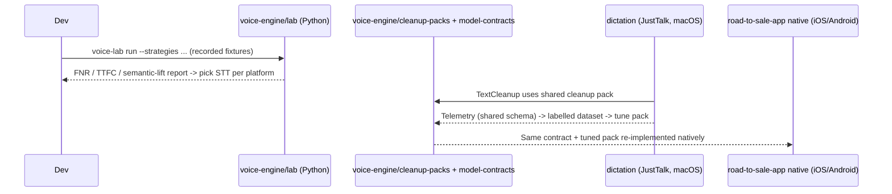

# System Flows — Road to Sale (monorepo)

End-to-end flows that span more than one module. Each step names the module or directory that
owns it, so a newcomer can navigate. For flows that stay inside one module, follow the link to
that module's own `flows.md`.

See [`architecture.md`](architecture.md) for the module map and [`api.md`](api.md) for the
boundary contracts referenced below.

---

## Flow A — A dealership sales session (the core product flow)

A rep starts a customer walk-in, walks the vehicle, the voice engine detects NADA steps and
feature demos, and evidence is written into the external SmartComply backend.

```mermaid
sequenceDiagram
  participant Rep
  participant UI as road-to-sale-app (UI)
  participant SE as SessionEngine / ChecklistEngine
  participant VE as IVoiceEngine -> Native module
  participant NAT as Native STT/cleanup (mirrors voice-engine contract)
  participant CAT as Bundled catalog + cue packs
  participant DB as SQLite + write queue
  participant SCC as SmartComplyClient
  participant SC as SmartComply backend (external, HTTP :8089)

  Rep->>UI: Start walk-in (SessionSetupScreen)
  UI->>SCC: addAuditAssignments + createOrUpdate
  SCC->>SC: POST /api/audit/addAuditAssignments, /userChecksheet/createOrUpdate
  SC-->>SCC: inspectionId + userChecksheetId
  UI->>SE: Begin session (ActiveSessionScreen)
  SE->>CAT: Load trim features -> project Feature -> CueAtom; load workflow cue pack
  SE->>VE: start({ language, customVocabulary })
  VE->>NAT: start capture + STT (per platform)
  loop While the rep talks
    NAT-->>VE: TranscriptEvent (partial/final) + cleanup
    VE-->>SE: onTranscript(event)
    SE->>SE: CueMatcher: event x CueAtoms -> detections
    SE->>UI: Mark step/feature green; show snippet
    SE->>DB: Queue cue event
    DB->>SCC: submitAnswer (createOrUpdateUserChksAns)
    SCC->>SC: POST /api/userChecksheet/createOrUpdateUserChksAns
  end
  Rep->>UI: Review + submit (SessionSummaryScreen)
  UI->>SCC: createOrUpdate { status: SUBMITTED }
  SCC->>SC: POST /api/userChecksheet/createOrUpdate
```

Step-by-step:

1. **Session start** — `road-to-sale-app` `SessionSetupScreen` → `SmartComplyClient`
   provisions the inspection (`addAuditAssignments`) and opens the UserChecksheet
   (`createOrUpdate`). Returns `inspectionId` + `userChecksheetId`. See
   [`road-to-sale-app/docs/smartcomply-contract.md`](../road-to-sale-app/docs/smartcomply-contract.md)
   §4.2–4.4.
2. **Context load** — `SessionEngine` loads the vehicle's trim features from the bundled
   catalog (sourced from
   [`vehicle-feature-catalog`](../vehicle-feature-catalog/docs/flows.md)) and the workflow
   cue pack (`src/cue-packs/`), projecting `Feature → CueAtom`.
3. **Voice start** — `IVoiceEngine.start()` → `NativeVoiceModule` → the platform's native
   STT/cleanup, which **mirrors the `voice-engine` contract**
   ([`model-contracts.md`](../voice-engine/docs/model-contracts.md)) — iOS Swift
   (`road-to-sale-app/ios/VoiceModule/`) or Android Kotlin
   (`road-to-sale-app/android/.../voice/`).
4. **Live detection** — transcript events flow back via `onTranscript`; the cue matcher
   produces detections; the UI turns covered steps/features green and shows the transcript
   snippet so the rep can trust it. The matching/cue logic mirrors the lab's
   [`voice-engine` flows](../voice-engine/docs/flows.md).
5. **Evidence write** — each detection is written to SQLite first, then forwarded by
   `SmartComplyClient.submitAnswer` to `createOrUpdateUserChksAns` (with `rtsCueId`,
   `rtsCueConfidence`, `rtsTranscriptSnippet`, `rtsVoiceAutoCompleted`). Offline? It stays
   in the queue (see Flow C).
6. **Submit** — the rep reviews on `SessionSummaryScreen`; submit reuses `createOrUpdate`
   with `status: SUBMITTED`.

Trade-in photos (`TradeInScreen`) follow a parallel path: captured locally, uploaded via
`POST /api/rts/tradePhoto/upload` (multipart) against the same `userChecksheetId`.

---

## Flow B — Choosing the STT/cleanup model that ships (research → product)

This is the cross-module flow that shows how "contracts, data, and learnings port — not code"
works in practice. It runs offline at dev time, not at runtime.



1. **Benchmark** — `voice-engine/lab` runs candidate STT strategies over recorded fixtures
   and writes structured reports (FNR, time-to-first-cue, semantic lift). This is the
   evidence behind "Apple SpeechTranscriber for iOS, sherpa-onnx + Silero VAD for Android."
   See [`voice-engine/docs/flows.md`](../voice-engine/docs/flows.md).
2. **Dogfood** — `dictation/` (JustTalk on macOS) runs the same **cleanup contract** and
   data pack daily, emitting telemetry on the shared schema. See
   [`dictation/docs/architecture.md`](../dictation/docs/architecture.md).
3. **Tune** — that telemetry produces the labelled corpus that tunes the shared cleanup pack
   in [`voice-engine/cleanup-packs/`](../voice-engine/cleanup-packs/).
4. **Inherit** — because the data pack and contract are shared, the tuned cleanup reaches the
   iOS/Android Road to Sale apps without porting code — they re-implement the same contract
   natively against the same data.

---

## Flow C — Offline resilience (SQLite write queue → SmartComply)

Cue events and lifecycle calls survive connectivity loss.

1. Every cue/lifecycle write is persisted to SQLite (`src/db/`) **before** the network call.
2. If offline, the write stays queued. `RetryQueueConsumer` drains on the
   `AppState 'active'` trigger (app foregrounded / network restored).
3. Retries use exponential backoff (1 s → 2 s → 4 s → 8 s → 16 s cap).
4. After 5 consecutive failures the **circuit breaker** trips (`markWriteFailed()`); the
   write is flagged failed and surfaced to the rep via a banner. Session data remains in
   SQLite and can be retried manually.

Authoritative detail (retry table, circuit breaker, error classes):
[`road-to-sale-app/docs/smartcomply-contract.md`](../road-to-sale-app/docs/smartcomply-contract.md)
§5–6.

---

## Flow D — JustTalk dictation (single-product, for contrast)

Not a Road to Sale flow, but the shared-contract sibling. Rep presses the activation key,
speaks, and cleaned text is pasted into the frontmost macOS app — entirely on-device.

1. Hold activation key → `RecordingEngine` captures audio (`DictationCore`).
2. Release → `SpeechTranscriber` (WhisperKit) transcribes the clip (batch variant of the
   STT contract).
3. `TextCleanup` (Apple Foundation Models, rule-based fallback) cleans the text using the
   shared cleanup pack.
4. `ClipboardPaster` inserts into the frontmost app and restores the prior clipboard.
5. `TelemetryStore` records the run on the shared telemetry schema (feeds Flow B).

Full walkthrough: [`dictation/docs/architecture.md`](../dictation/docs/architecture.md) and
[`dictation/README.md`](../dictation/README.md).
