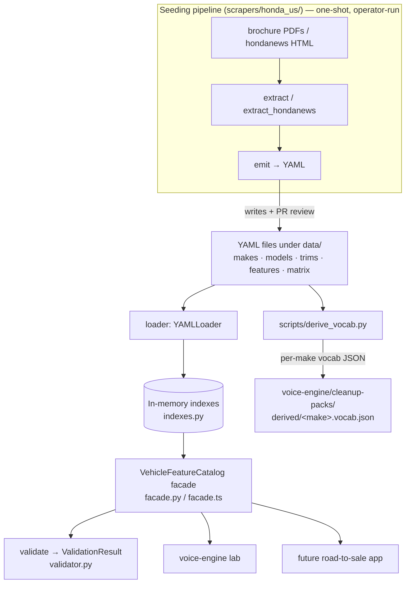

# Vehicle Feature Catalog — Architecture

Last updated: `2026-06-22`

> Part of the Road to Sale monorepo. See the top-level
> [system architecture](../../docs/architecture.md) for how this module sits
> beside the voice engine and the road-to-sale app. This module **feeds the
> voice cleanup vocab** — see [voice-engine architecture](../../voice-engine/docs/architecture.md)
> and [model contracts](../../voice-engine/docs/model-contracts.md).

## Purpose

A normalized, brand-extensible catalog of vehicle Makes → Models → Trims → Features and the sparse `Trim ↔ Feature` availability matrix. Honda US is the first make; a small Toyota fixture proves brand-extensibility. The catalog is a static, in-memory data layer — not a database engine.

The catalog exists for two reasons:

1. To answer one question reliably: *"For the trim the rep is selling, which features can legitimately be demonstrated?"* (consumed by the voice lab and, later, the road-to-sale app).
2. To **derive per-make STT (speech-to-text) vocabulary** for the voice pipeline. A Honda store's model, trim, and feature proper nouns are exactly the words generic speech-to-text gets wrong. `scripts/derive_vocab.py` reads them from the catalog and writes them to `voice-engine/cleanup-packs/derived/<make>.vocab.json` (see the catalog → STT-vocab bridge below).

## Design principles

| Principle | Consequence |
|---|---|
| Brochure-shaped data | Schema matches how dealer brochures present features: features are global, trims tick boxes |
| Brand extensibility from day one | Schema is brand-agnostic; Honda is one make, Toyota another, with zero schema changes |
| No runtime database engine | YAML files in git + in-memory loaders. No SQLite, no Postgres, no server, no migrations |
| Immutable post-load | Catalog state is fixed after `load()`. Mutations happen by editing YAML in git, not via API |
| YAML in git is the source of truth | The scraper is a *seeding tool* that writes YAML you review in PRs. The committed YAML, not any scraper run, is canonical |
| Facade-only access | Consumers go through `VehicleFeatureCatalog`; reaching into loader internals is forbidden |
| Catalog ↔ voice-engine isolation | Neither side imports the other (enforced in CI, see Isolation guarantees) |

## Components

The module has four layers plus one seeding pipeline and one bridge script.



| Layer | Python | TypeScript |
|---|---|---|
| Entities (data model) | `src/python/vehicle_feature_catalog/entities.py` | `src/ts/entities.ts` |
| Errors | `errors.py` | `errors.ts` |
| Loader (YAML → entities) | `loader.py` (`YAMLLoader`) | `loader.ts` (`YAMLLoader`) |
| Indexes (in-memory lookups) | `indexes.py` (`CatalogIndexes`) | `indexes.ts` (`buildIndexes`) |
| Validator (integrity checks) | `validator.py` (`Validator`) | `validator.ts` (`validateCatalog`) |
| Facade (public API) | `facade.py` (`VehicleFeatureCatalog`) | `facade.ts` (`VehicleFeatureCatalog`) |
| Public entry point | `__init__.py` (re-exports) | `index.ts` (re-exports) |

The Python package and the TS package are **independent reimplementations of the same contract** — they share the YAML data dir but no code. The field shapes in `entities.py` and `entities.ts` are mirrored 1:1 ("Do not drift" is written into both files).

## Schema

Five entities. Four are entity records; one (`TrimFeature`) is a matrix cell.

```
Make            { id, name, country }
Model           { id, make_id, name, year, body_style? }
Trim            { id, model_id, name, msrp_range? }
Feature         { id, display_name, category, brand_scope, cue_phrases[], synonyms[] }
TrimFeature     { trim_id, feature_id, availability: 'standard' | 'optional' | 'unavailable' }
```

See [`api.md`](./api.md) for full field-level definitions.

### Why this shape

- **Features are global.** "Wireless Apple CarPlay" is one feature, defined once, referenced by every trim that has it. No per-model duplication.
- **Brand scope per feature.** Universal features cross brands ("Heated Front Seats"). Brand-specific features stay scoped (`Honda Sensing 360+`, future `Toyota Safety Sense`). The scope lives on the feature itself, not in references to it.
- **Availability is a sparse matrix.** Only trims that have a feature appear in the matrix. A missing trim-feature pair means the feature is unavailable. Storage stays small.

## File layout

```
vehicle-feature-catalog/
├── data/                                 ← source of truth (YAML in git)
│   ├── makes/honda.yaml
│   ├── makes/toyota.yaml
│   ├── models/honda/civic.yaml           ← one file per model
│   ├── models/toyota/camry.yaml
│   ├── trims/honda/civic/2026/sport.yaml ← trims/<make>/<model>/<year>/<trim>.yaml
│   ├── features/universal/wireless_apple_carplay.yaml
│   ├── features/honda/honda_sensing_360plus.yaml
│   ├── features/toyota/...
│   └── matrix/honda.yaml                 ← the brochure tick-box grid (one file per make)
├── data-cache/                           ← scraper inputs (gitignored body, .gitkeep tracked)
│   ├── brochures/honda/2026/<slug>.pdf   ← downloaded brochure PDFs
│   └── hondanews/2026/<slug>.html        ← operator-saved press-release HTML
├── src/
│   ├── python/vehicle_feature_catalog/   ← in-memory loader + query helpers (facade)
│   └── ts/                               ← TS mirror of the same contract
├── scrapers/honda_us/                    ← seeding pipeline (see below)
├── scripts/
│   ├── validate.py                       ← CLI validator (invoked by the voice-lab CLI)
│   └── derive_vocab.py                   ← catalog → STT-vocab bridge
├── tests/{python,ts}/
├── docs/
├── build.sh                              ← pip install + pytest + npm test/build
├── pyproject.toml                        ← deps; `[scrapers]` extra for the pipeline
└── package.json
```

One YAML file per entity. One matrix file per make. Files are reviewed in PRs whether hand-authored or scraper-emitted.

To build, test, run the CLIs, and deploy this module locally, see [`build.md`](./build.md).

### Example: feature file

```yaml
# data/features/honda/honda_sensing_360plus.yaml
id: honda.feature.honda_sensing_360plus
display_name: Honda Sensing 360+
category: driver_assistance
brand_scope: honda
cue_phrases:
  - Honda Sensing 360 plus
  - Honda Sensing 360+
synonyms:
  - 360 plus
```

### Example: matrix file (the brochure grid, flattened)

```yaml
# data/matrix/honda.yaml
make_id: honda
entries:
  - trim_id: honda.cr-v-hybrid-awd.2026.sport-touring
    features:
      - { feature_id: universal.feature.wireless_apple_carplay, availability: standard }
      - { feature_id: honda.feature.honda_sensing_360plus, availability: standard }
```

The loader ignores any extra keys on a matrix entry, so the scraper is free to annotate low-confidence entries with `extraction_confidence: low` / `needs_review: true` without breaking the schema (see the scraper section).

## The scraper pipeline (real, shipped)

> Earlier revisions of this doc called the scraper "deferred — v1 is hand-curation only." **That is no longer true.** The Honda US scraper at [`scrapers/honda_us/`](../scrapers/honda_us/README.md) is built, tested (`tests/python/scrapers/`), and has already emitted its output into `data/` — the Honda models (Civic, Accord, HR-V, Pilot, Passport, Odyssey, Ridgeline, Prologue), their trims, and ~240 Honda feature files all came from it.

It is a **one-shot seeding tool, not a service**. Two input sources feed one emit step:

| Module | Role |
|---|---|
| `discover.py` (`BrochureDiscoverer`) | Find brochure PDF URLs on `automobiles.honda.com` (pure ranking helper `extract_brochure_url` is unit-tested) |
| `download.py` (`BrochureDownloader`) | Idempotent PDF cache into `data-cache/brochures/honda/<year>/<slug>.pdf` |
| `extract.py` (`BrochureExtractor`) | `pdfplumber`-driven trim × feature matrix recovery from brochure PDFs |
| `extract_hondanews.py` (`extract_from_hondanews_html`) | BeautifulSoup parser for operator-saved hondanews.com press-release HTML; tags each result `high` / `medium` / `low` confidence |
| `emit.py` (`CatalogEmitter`) | Resolve feature labels to existing feature IDs (curated alias table + name/synonym/cue matching) or mint new Honda-scoped features; write model + trim YAML; **append** matrix entries while preserving hand-seeded CR-V Hybrid AWD entries |
| `cli.py` | `python -m scrapers.honda_us.cli` — ties the steps together; `--source brochure-pdf` (default) or `--source hondanews-html` |

Why two sources: `automobiles.honda.com` brochures carry trim *names* but not the trim × feature matrix — that detail lives in the corresponding `hondanews.com` press release. Akamai blocks both sites from CI and dev networks, so the operator saves pages in a browser and the extractor reads the saved files. The full operator workflow, CLI flags, and the confidence/review fallback are in [`scrapers/honda_us/README.md`](../scrapers/honda_us/README.md). [`flows.md`](./flows.md) traces the flow step by step.

The scraper's dependencies sit behind an optional extra in `pyproject.toml` (`pip install -e '.[scrapers]'` → `requests`, `beautifulsoup4`, `pdfplumber`). The core catalog library only needs `PyYAML`.

## The catalog → STT-vocab bridge

[`scripts/derive_vocab.py`](../scripts/derive_vocab.py) is the seam between this module and the voice engine. For each make it reads the catalog YAML directly (model names, trim names, universal feature display names, and short synonyms) and writes a deduped term list to:

```
voice-engine/cleanup-packs/derived/<make>.vocab.json
```

Scoping is deliberately **one make per file** so the term list fits WhisperKit's small bias window — a Honda store gets Honda words, a Toyota store gets Toyota words. The voice pipeline merges this derived list into the same road-to-sale lexicon bucket that the hand-authored dealership glossary fills. The output JSON is marked *"derived; do not hand-edit"* — regenerate it by re-running the script, never by editing the JSON.

This script crosses the module boundary by **writing a file** that the voice engine reads at build or config time — not by importing voice-engine code (which the isolation check forbids).

## Isolation guarantees

- **No imports out.** Nothing under `vehicle-feature-catalog/src/`, `scrapers/`, or `tests/` imports from `voice-engine/` (`voice_lab`).
- **No imports in (except via facade).** External code imports `VehicleFeatureCatalog` from the entry point and nothing else. The voice-engine library never imports `vehicle_feature_catalog`.
- **Communication is by data, not code.** The catalog feeds the voice engine through derived YAML/JSON files (the vocab packs) and through the consumer/lab layer that projects `Feature → CueAtom`. There is no direct cross-module import.
- **Enforced in CI** by [`scripts/check_imports.py`](../../scripts/check_imports.py) (repo root), which AST-checks Python imports and string-checks TS imports in both directions. The voice-engine **lab** is intentionally exempt — it is the consumer layer and is allowed to import the catalog facade.

## Known backlog (content, not code)

- **Spec-sheet rows mis-emitted as features.** Many auto-emitted files under `data/features/honda/` are brochure *spec-sheet rows* — e.g. `curb-weight-lbs-awd.yaml`, `torque-lb-ft-2-fwd.yaml`, `horsepower-hp1-awd.yaml`, `102-inch-digital-instrument-cluster.yaml` — not sellable, demonstrable features. The extractor cannot reliably tell a sellable feature from a spec row, so it over-captures. This is a **content-review backlog item** (prune and recategorize during PR review of emitted models), not a code defect. Their seed `cue_phrases` (just the display name) also need rep-natural expansion before voice matching is trusted.
- **Per-feature richer metadata** (`MSRP delta when optional`, `availability_disclaimer`) — deferred until a consumer needs it.
- **Localization** (`display_name` in non-English) — deferred. Single-locale v1.

## Brand extensibility

The catalog ships a small Toyota fixture (`makes/toyota.yaml`, `models/toyota/camry.yaml`, Toyota features, `matrix/toyota.yaml`) sharing universal features with Honda. Adding a make is **YAML-only** when the schema fits — no code changes. See Flow 4 in [`flows.md`](./flows.md).
