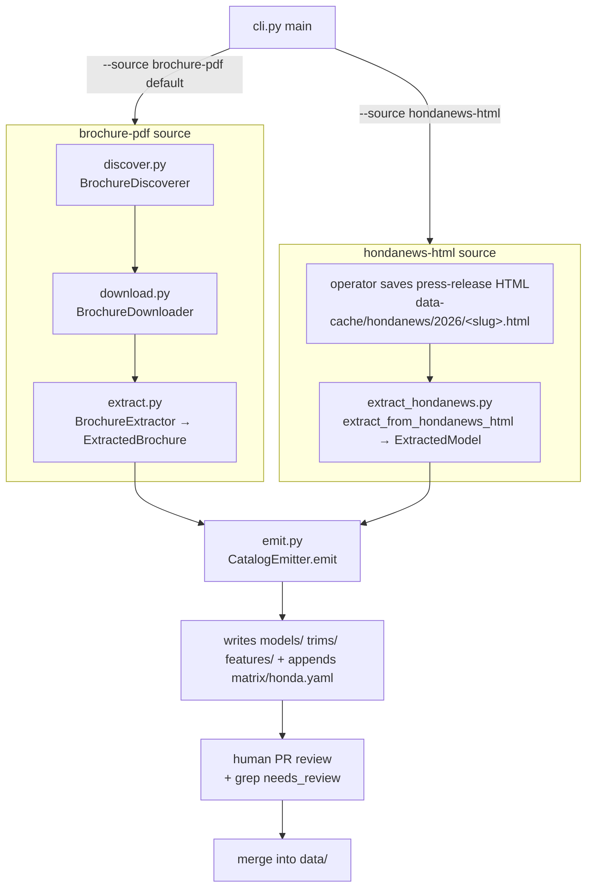
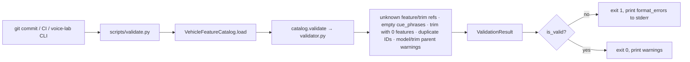
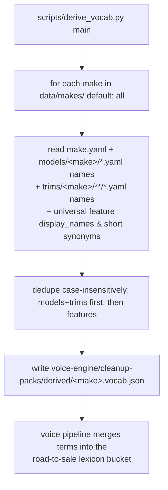
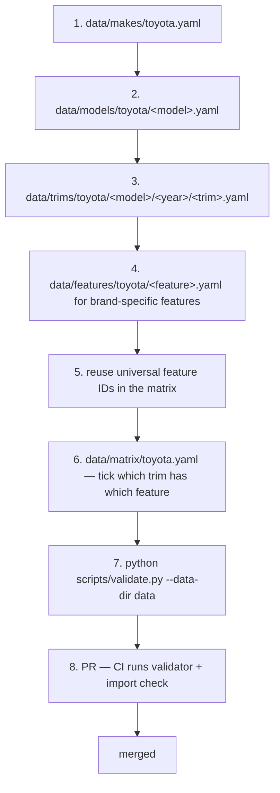

# Vehicle Feature Catalog — Code Flows

Last updated: `2026-06-22`

This document traces the code paths a new engineer needs to understand the catalog end-to-end, file by file with real entry points. See [`architecture.md`](./architecture.md) for the big picture and [`api.md`](./api.md) for the contract.

Flows covered:

1. **Catalog load + lookup** — the facade read path every consumer uses.
2. **The scraper pipeline** — discover → download → extract → emit → review → YAML in `data/`.
3. **Validation** — the CI / pre-commit gate.
4. **derive_vocab** — catalog → per-make vocab JSON → voice-engine cleanup packs.
5. **Adding a new make** — the YAML-only brand-extensibility flow.
6. **Feature → CueAtom projection** — how consumers bridge into the voice engine.

---

## Flow 1 — Loading the catalog + querying a trim

The first thing every consumer does, then the hot path.

```mermaid
sequenceDiagram
  participant App as Consumer (lab / app)
  participant Facade as VehicleFeatureCatalog
  participant Loader as YAMLLoader
  participant Index as CatalogIndexes

  App->>Facade: load(data_dir)
  Facade->>Loader: read_all(data_dir)
  Loader->>Loader: parse YAML under makes/ models/ trims/ features/ matrix/
  Loader-->>Facade: RawCatalog (entity lists)
  Facade->>Index: build(makes, models, trims, features, trim_features)
  Index->>Index: by-id dicts; raise DuplicateIdError on collision
  Index-->>Facade: CatalogIndexes
  Facade-->>App: VehicleFeatureCatalog instance
  App->>Facade: list_features_for_trim(trim_id)
  Facade->>Index: features_by_trim[trim_id] → filter availability → deref feature_id
  Facade-->>App: list[Feature]
```

**Files touched (Python; TS mirrors it):**

1. Consumer imports `from vehicle_feature_catalog import VehicleFeatureCatalog` → resolves to `src/python/vehicle_feature_catalog/__init__.py` (re-exports the facade).
2. `facade.py::VehicleFeatureCatalog.load(data_dir)` calls `loader.py::YAMLLoader.read_all(path)`.
3. `loader.py` walks `data/makes/*.yaml`, `data/models/**/*.yaml`, `data/trims/**/*.yaml`, `data/features/**/*.yaml`, `data/matrix/*.yaml`, validating each file's *shape* (required keys, list types, valid `availability`) and raising `LoadError` on any problem. Returns a `RawCatalog`.
4. `indexes.py::CatalogIndexes.build(...)` constructs the in-memory lookups: `makes_by_id`, `models_by_id`, `trims_by_id`, `features_by_id`, plus the matrix indexes `features_by_trim` and `trims_by_feature`, and the parent indexes `models_by_make` / `trims_by_model`. Raises `DuplicateIdError` on any ID collision (including cross-entity-type collisions).
5. Facade returns the constructed instance.

After load, every query is an in-memory dict lookup — no disk I/O. `list_features_for_trim` (`facade.py`) looks up `features_by_trim[trim_id]`, filters by `availability`, dereferences each `feature_id` via `features_by_id`, and returns the materialized `Feature`s.

> Integrity validation (dangling references, empty cue_phrases) is **not** part of `load()` — it's a separate `validate()` call (Flow 3).

---

## Flow 2 — The scraper pipeline (discover → download → extract → emit → review)

The one-shot seeding tool at [`scrapers/honda_us/`](../scrapers/honda_us/README.md) produced the Honda data in `data/`. Operator-run, not a service. Entry point: `python -m scrapers.honda_us.cli`.

There are **two input sources** feeding a shared emit step, chosen by `--source`:



**brochure-pdf path** (`cli.py::main`, default):

1. **Discover** — `discover.py::BrochureDiscoverer.discover(slugs)` fetches each Honda model page and ranks `.pdf` anchors using the pure `extract_brochure_url` helper. Returns `{slug → url}` plus per-slug errors. (Bypass with `--from-pdf SLUG=PATH` or `--skip-discover`.)
2. **Download** — `download.py::BrochureDownloader.download_all(urls)` caches each PDF idempotently at `data-cache/brochures/honda/<year>/<slug>.pdf` (skips non-empty existing files; retries 429/5xx).
3. **Extract** — `extract.py::BrochureExtractor.extract(pdf_path)` uses `pdfplumber` to recover trims + a `FeatureRow` per feature label with a per-trim availability map → `ExtractedBrochure`. `is_useful()` gates whether emit runs.

**hondanews-html path** (`cli.py::_run_hondanews_html`, `--source hondanews-html`):

1. The operator saves each press release from the browser to `data-cache/hondanews/2026/<slug>.html` (Akamai blocks both sites from CI and dev, so there is no network step here — see the [scraper README](../scrapers/honda_us/README.md)).
2. `extract_hondanews.py::extract_from_hondanews_html(path)` parses it with BeautifulSoup, trying a comparison table first, then per-trim "Standard Equipment" lists, then a free-text fallback. It tags the result `extraction_confidence = high | medium | low` (`ExtractedModel` subclasses `ExtractedBrochure`). Missing `<slug>.html` files are skipped with a clear message; the batch continues.

**Shared emit** (`emit.py::CatalogEmitter.emit`):

1. **Resolve features** — for each extracted label, match it to an existing feature ID using the curated `LABEL_TO_DISPLAY_NAME` alias table plus a normalized display-name/synonym/cue match (`_resolve_or_create_feature`). Unmatched labels become **new Honda-scoped feature files** with a single seed `cue_phrase` (the display name) — flagged in the file header as needing hand expansion.
2. **Write model + trim YAML** under `data/models/honda/<slug>.yaml` and `data/trims/honda/<slug>/<year>/<trim>.yaml`.
3. **Append matrix** — merge new cells into `data/matrix/honda.yaml` **without overwriting** the hand-seeded CR-V Hybrid AWD entries; cells dedupe on `(trim, feature)` with stronger availability winning. Low-confidence entries get `extraction_confidence: low` / `needs_review: true` (the loader ignores these extra keys; `grep -n needs_review data/matrix/honda.yaml` is the operator's review queue).

`cli.py` prints a `RunReport` (discovered, downloaded, emitted, failed). `--dry-run` runs discover+download+extract but writes nothing.

> Manual review is required after every run: expand seed `cue_phrases`, check trim lists, and **prune spec-sheet rows the extractor mistook for features** (e.g. `curb-weight-*`, `torque-*` files — see the backlog note in [`architecture.md`](./architecture.md)). PDF and HTML extraction is imperfect by design; the YAML is the source of truth only after review and merge.

---

## Flow 3 — Validation (CI / pre-commit)



**Files touched:**
- `scripts/validate.py` — CLI wrapper (`--data-dir` required). Catches `LoadError` → exit 1. This is the script the **voice-lab CLI invokes**.
- `facade.py::validate()` → `validator.py::Validator.check(...)` — pure checks over the in-memory state. Errors fail the build; parent-reference problems are warnings.

A failing validation in CI blocks the PR; the engineer fixes the YAML and re-pushes.

---

## Flow 4 — derive_vocab (catalog → STT vocab → voice-engine cleanup packs)

The bridge that turns the catalog's proper nouns into speech-recognition bias terms. Entry point: `python3 scripts/derive_vocab.py [make_id ...]`.



**Files touched:**
- `scripts/derive_vocab.py::derive_make(make_id)` reads catalog YAML **directly** (it does not go through the facade — it's a sibling tool, not a consumer): make name, model `name`s, trim `name`s, and universal-feature `display_name`s plus synonyms ≤ 3 words. Sentence-like `cue_phrases` are deliberately excluded (they aren't vocabulary terms).
- Writes `voice-engine/cleanup-packs/derived/<make>.vocab.json` (one file **per make** to fit WhisperKit's small bias window). The JSON is marked *"derived; do not hand-edit."*

The voice pipeline merges these terms into the same road-to-sale lexicon bucket that the hand-authored dealership glossary fills. See [voice-engine model contracts](../../voice-engine/docs/model-contracts.md) and [architecture](../../voice-engine/docs/architecture.md). This is a **file handoff**, not a code import — it respects the catalog ↔ voice-engine isolation boundary (`scripts/check_imports.py`).

---

## Flow 5 — Adding a new make (e.g., Toyota)

Brand-extensibility. No code changes; only YAML (a Toyota fixture already ships).



No code changes are required as long as the schema fits. A genuinely new field would be extended in `entities.py` **and** `entities.ts` (kept in sync), and both loaders updated — the rare case.

---

## Flow 6 — How consumers project Features into voice-engine CueAtoms

The catalog returns `Feature` objects. The consumer (lab orchestrator or future road-to-sale app) projects them into the voice engine's `CueAtom` itself — the catalog stays vehicle-domain pure and never sees `CueAtom`.

```python
features = catalog.list_features_for_trim(trim_id)
atoms = [
    CueAtom(
        id=f.id,
        display_name=f.display_name,
        source="feature",
        cue_phrases=f.cue_phrases,
        synonyms=f.synonyms,
        metadata={"feature_id": f.id, "category": f.category},
    )
    for f in features
]
```

The catalog never imports the voice engine and vice versa. They communicate through the consumer's glue (this flow) and through the derived vocab files (Flow 4).

## What's NOT in this module

- Cue matching → `voice-engine`
- Workflow cue composition (`active_cues = universal ∪ feature_cues_for(trim)`) → the consumer
- Mutation flows → none; the catalog is immutable post-load (mutate by editing YAML in git)
