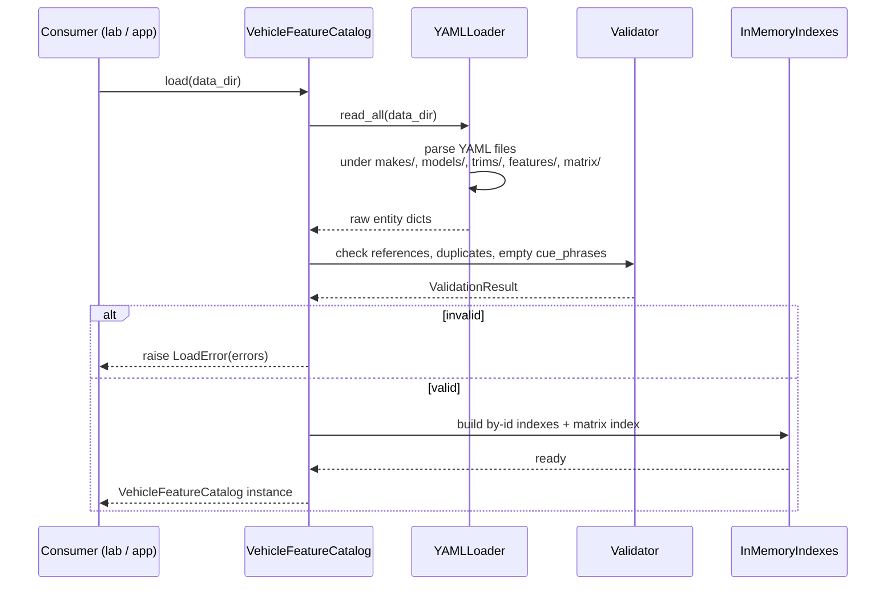
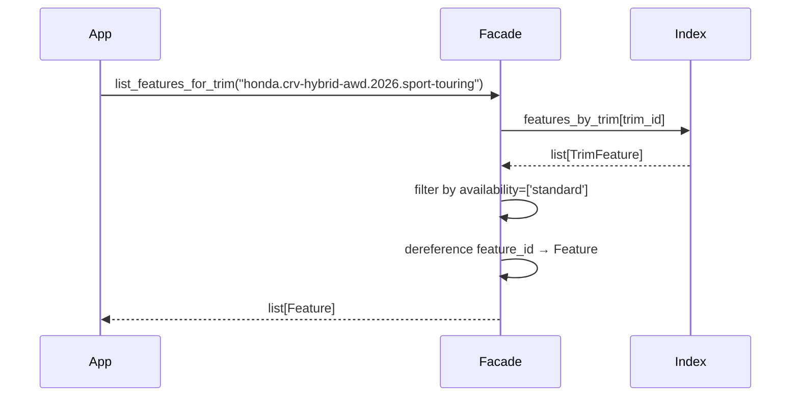
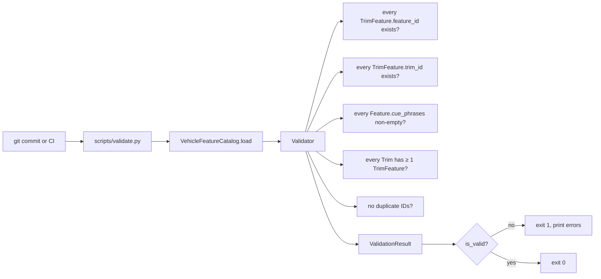
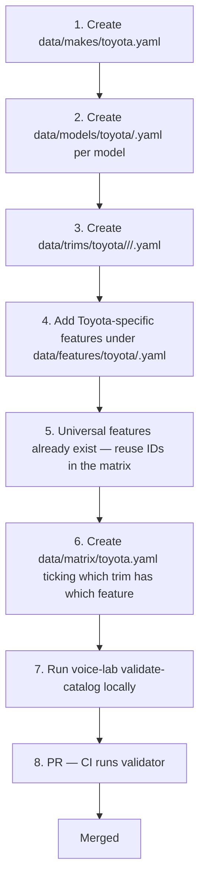

# Vehicle Feature Catalog — Code Flows

Last updated: `2026-05-22`

This document traces the code paths a new engineer needs to follow to understand the catalog end-to-end. Each flow goes file-by-file with the actual entry points.

## Flow 1 — Loading the catalog at startup

The single thing every consumer does first.



**Files touched (Python side):**
1. Consumer imports `from vehicle_feature_catalog import VehicleFeatureCatalog`
2. Resolves to `vehicle-feature-catalog/src/python/vehicle_feature_catalog/__init__.py` — re-exports the facade
3. `__init__.py` → `facade.py` (the `VehicleFeatureCatalog` class)
4. `facade.load()` → `loader.py` (`YAMLLoader.read_all(data_dir)`)
5. `loader.py` walks `data/makes/*.yaml`, `data/models/**/*.yaml`, `data/trims/**/*.yaml`, `data/features/**/*.yaml`, `data/matrix/*.yaml`
6. Parsed dicts → `validator.py` (`Validator.check(entities)`)
7. On success → `indexes.py` builds in-memory lookup dicts:
   - `by_id: dict[str, EntityT]` per entity type
   - `features_by_trim: dict[trim_id, list[TrimFeature]]`
   - `trims_by_feature: dict[feature_id, list[TrimFeature]]`
8. Facade returns the constructed instance to the consumer

After this, every query is in-memory dict lookup. No disk I/O.

## Flow 2 — Querying features for a trim

The hot path. Called once per script in the lab; called once per live session in the future app.



**Files touched:**
1. `facade.py::list_features_for_trim(trim_id, availability)`
2. `indexes.py::features_by_trim[trim_id]` — O(1) dict lookup
3. List comprehension filters by `availability`
4. For each `TrimFeature`, look up the `Feature` via `by_id` index
5. Return the materialized `Feature` list

No I/O, no allocation surprises. The hot path is meant to be fast enough that consumers don't cache it themselves.

## Flow 3 — Validation (CI / pre-commit)



**Files touched:**
- `vehicle-feature-catalog/scripts/validate.py` — the CLI wrapper
- `validator.py` — pure checks against the in-memory state
- Failed validation in CI = PR is blocked. Engineer fixes YAML, re-pushes.

## Flow 4 — Adding a new make (e.g., Toyota later)

The brand-extensibility flow. No code changes; only YAML.



**No code changes required** as long as the schema fits. If a new field is needed (e.g., a brand-specific category), the schema is extended in `entities.py` and the loaders adapt — but that's the rare case.

## Flow 5 — How consumers project Features into voice-engine CueAtoms

The catalog returns `Feature` objects. The consumer projects them into `CueAtom` (voice-engine vocabulary) themselves. This is the F2 decision: the catalog stays vehicle-domain pure.

```python
# consumer-side (lab orchestrator, future road-to-sale-app)
features = catalog.list_features_for_trim(trim_id)
atoms = [
    CueAtom(
        id=f.id,
        display_name=f.display_name,
        source="feature",
        cue_phrases=f.cue_phrases,
        synonyms=f.synonyms,
        metadata={"feature_id": f.id, "category": f.category},
    )
    for f in features
]
```

The catalog never sees `CueAtom`. The voice engine never sees `Feature`. They communicate via the consumer's glue.

## What's NOT here

- Cue matching (lives in `voice-engine`)
- Workflow cue composition (`active_cues = universal ∪ feature_cues_for(trim)`) — lives in the consumer
- Mutation flows — catalog is immutable post-load
- Scraper / automation — deferred; v1 is hand-curation
