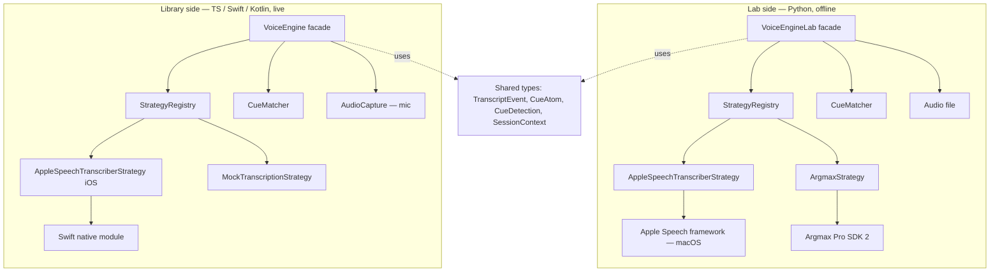

# Voice Engine — Architecture

Last updated: `2026-05-22`

## Purpose

A strategy-based audio + STT + cue-matching layer that:
- captures audio (live mic in the mobile library; reads files in the lab)
- runs any registered STT strategy to produce transcript events
- matches transcript events against caller-supplied cue atoms to produce cue detections

It is **brand-agnostic and product-agnostic**. It does not know Honda exists, does not define cue phrases, does not interpret audit items.

## Design principles

| Principle | Consequence |
|---|---|
| Strategy pattern, no exceptions | Every STT engine implements the same interface. Vendor SDKs never leak out of the strategy file |
| Two streams from one strategy | Every strategy MUST surface BOTH the vendor's fast unstable stream AND its slower stable stream, tagged `stability: 'partial' \| 'final'` on each event |
| Capture is separate from STT | Audio capture is its own subsystem feeding the strategy; multiple downstream consumers possible |
| Voice engine consumes cue atoms, does not define them | Consumers (lab, future app) pull cue atoms from the catalog or universal-cue files and pass them in |
| Lab-side and library-side are one module | Same strategy registry, same data types, separate entry points for offline-file vs live-mic |
| Telemetry hooks present from day one | Every event timestamp is wall-clock + audio-relative; latency is captured before any optimization work |
| Facade-only access | `VoiceEngineLab` (Python) and `VoiceEngine` (TS) are the only public entry points |

## Component diagram



## Sub-systems

### Strategy layer

Every STT engine sits behind `TranscriptionStrategy`. Vendor SDKs are imported only inside their own strategy file. Switching engines = changing the registered strategy name; the rest of the system doesn't know.

Strategies in v1:
- **Lab (Python):** `AppleSpeechTranscriberStrategy` (macOS variant), `ArgmaxStrategy`.
- **Library (TS):** `AppleSpeechTranscriberStrategy` (iOS, real native module) + `MockTranscriptionStrategy` (replays JSONL events for tests / showcase mode).

Argmax is **not** wired into the library skeleton. The lab will tell us if Argmax is needed on iOS or only Android.

### Capture layer

In the library, audio capture is a separate subsystem from STT. It owns:
- mic permission
- session configuration
- rolling buffer
- chunk-frame distribution to one or more consumers
- interruption / pause / resume

The lab doesn't have a capture layer — it reads audio files. The same `TranscriptionStrategy` interface accepts either.

### Cue matcher

Generic phrase + synonym matcher. Takes a transcript stream + an atom set, emits detections. Knows nothing about Honda, audit items, or NADA steps. The active atom set is composed by the consumer.

Matching rules:
- Direct substring match on any `cue_phrases` entry
- Synonym match (e.g. "CarPlay" matches the `wireless_apple_carplay` atom's synonym list)
- Multiple phrases hitting the same atom in one event = single detection
- Detection fires on first match (partial or final), not waiting for final unless caller filters

### Registry

One file per language. Adding a strategy is editing one file outside the strategy itself.

## Two-stream stability (binding rule)

The strongest learning across the research (Argmax, Salesforce, Gladia) is: do not collapse fast unstable output and slow stable output into one stream. The product has two consumers:

| Consumer | Wants | Filter |
|---|---|---|
| Live UI (rep-facing) | Fastest possible cue detection, accepts unstable output | `event.stability == 'partial'` |
| Audit evidence lane | Stable text + timestamps, can wait | `event.stability == 'final'` |

Every strategy emits both. Consumers filter. No second pipeline.

A strategy that only provides one stream is **disqualified**.

## Normalized event shape

Same fields, same names, in Python and TS:

```
TranscriptEvent {
  text: string
  stability: 'partial' | 'final'
  timestamp_ms: int                # audio-relative
  latency_ms_from_audio_start: int # wall-clock from audio start
  confidence: float | null
  engine_metadata: dict            # opaque, per-engine
}
```

`engine_metadata` is opaque to everything outside the strategy. Used for debugging and reporting; never branched on by core logic.

## Isolation guarantees

- **No imports from `vehicle-feature-catalog/`.** Voice engine knows nothing about Honda, Make, Model, Trim, Feature. The consumer (lab orchestrator, future app) does the projection from `Feature → CueAtom`.
- **No imports from `road-to-sale-app/`.** Voice engine knows nothing about NADA, audit items, sessions, or workflow.
- **No imports from `demo/`.** Demo material is one-way; voice engine doesn't reference it.
- **Vendor SDKs stay behind strategies.** Apple Speech, Argmax SDK — imported only inside the strategy file that wraps them.
- **CI static-import check** enforces all of the above.

## Folder layout

```
voice-engine/
├── lab/                         Python comparison lab
│   ├── src/voice_lab/
│   │   ├── __init__.py          # re-exports VoiceEngineLab facade
│   │   ├── facade.py
│   │   ├── strategies/
│   │   │   ├── registry.py
│   │   │   ├── apple_speech_transcriber.py
│   │   │   └── argmax.py
│   │   ├── matcher/
│   │   │   └── cue_matcher.py
│   │   ├── types.py             # TranscriptEvent, CueAtom, CueDetection (hand-written)
│   │   ├── scoring/             # lab-only — pass/partial/fail rules
│   │   ├── reporting/           # lab-only — markdown + CSV report writers
│   │   ├── synthesis/           # ElevenLabs TTS + noise overlay
│   │   └── cli.py
│   ├── fixtures/                # scripts, generated audio, human audio, noise
│   ├── cue-packs/               # universal_workflow_cues.yaml (workflow cues, not features)
│   ├── reports/                 # gitignored
│   ├── tests/
│   ├── docs/
│   ├── pyproject.toml
│   ├── build.sh
│   └── README.md
├── src/                         TS library (skeleton)
│   ├── index.ts                 # re-exports VoiceEngine facade
│   ├── facade.ts
│   ├── strategies/
│   │   ├── registry.ts
│   │   ├── apple-speech-transcriber.ts
│   │   └── mock.ts
│   ├── matcher/
│   │   └── cue-matcher.ts
│   ├── capture/                 # mic capture (live)
│   └── types/                   # TranscriptEvent, CueAtom, CueDetection (hand-written)
├── ios/                         Swift native module
├── android/                     Kotlin stub
├── docs/                        # this file + api.md + flows.md
├── tests/
├── package.json
├── build.sh
└── README.md
```

## What the voice engine deliberately does NOT do

| Not done | Reason |
|---|---|
| Summarization | Separate strategy, separate concern, later |
| Diarization in the live path | Async, post-session — lives next to the evidence lane, not in the fast lane |
| Cue *definition* | The catalog (for features) and consumer (for workflow cues) define them; engine only matches |
| Audit-item interpretation | `road-to-sale-app`'s job |
| Telemetry shipping | Hooks present, exporters / dashboards in a later PRD |

## Why this shape

Cross-checking against the audio architecture doc (`docs/ROAD_TO_SALE_AUDIO_ARCHITECTURE.md`) and the learnings doc (`dev/docs/ROAD_TO_SALE_AUDIO_LEARNINGS.md`):

- **Strategy pattern** → STT landscape evolves quickly; new vendor support must be a one-file change
- **Two streams** → live UX and audit evidence have incompatible speed/stability needs from the same audio
- **Capture separate from STT** → multiple downstream consumers; supports VAD / silence gating without coupling
- **Cue atoms come from outside** → keeps the engine reusable beyond Road to Sale
- **Telemetry from day one** → speech-engine choice must be evidence-based, not assumption-based

## Open architectural questions

See PRD open questions OQ1 (Apple SpeechTranscriber macOS variant), OQ2 (Argmax Python bindings vs CLI), OQ10 (custom vocabulary), OQ11 (confidence score normalization).
