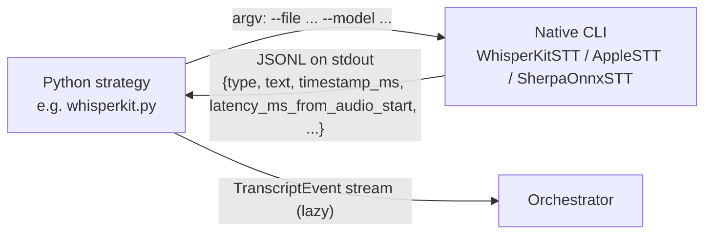

# Voice Engine — Architecture

Last updated: `2026-06-22`

> **Read this first — what `voice-engine` is.** It is the **contract, data, and
> research core** for the repo's speech pipeline — **not a library the apps link
> against.** Nothing in this repo imports the TS package. The production apps
> *re-implement its contracts in native code*:
> - `road-to-sale-app/ios` — Apple `SFSpeechRecognizer` / `SpeechTranscriber`
> - `road-to-sale-app/android` — sherpa-onnx
> - `dictation/` (macOS) — links WhisperKit directly via `DictationCore`, and
>   mirrors the cleanup contract in Swift (`dictation/Shared/Sources/DictationCore/TextCleanup.swift`).
>
> The one **working, runnable** part of this module is the Python lab
> (`lab/`). Everything else here is the *spec* the native code conforms to:
> the data types, the cleanup-pack JSON, and `docs/model-contracts.md`.

For the whole-system map see [`../../docs/architecture.md`](../../docs/architecture.md)
and the audio design in [`../../docs/ROAD_TO_SALE_AUDIO_ARCHITECTURE.md`](../../docs/ROAD_TO_SALE_AUDIO_ARCHITECTURE.md).

---

## 1. The five pieces of this module

```
voice-engine/
├── lab/                    Python comparison harness  ← the live, working core
├── cleanup-packs/          Canonical cleanup data packs (JSON)  ← data, shipped to native apps
├── docs/model-contracts.md The two model contracts (STT + cleanup)  ← the spec
├── src/                    TS reference skeleton (only `mock` runs)  ← reference, mirrored natively
└── native/                 Swift / Kotlin STT CLIs the lab shells out to
```

| Piece | Status | What it is |
|---|---|---|
| `lab/` (Python) | **Working** | Offline STT comparison harness. Registry of 5 STT strategies, cue matcher, scoring, reporting. Facade: `VoiceEngineLab`. |
| `cleanup-packs/` | **Canonical data** | `dictation.json`, `road-to-sale.json` — command grammar, fillers, junk phrases, LLM prompts, and (RTS) a dealership lexicon. The native apps load these verbatim. |
| `docs/model-contracts.md` | **Canonical spec** | Defines the two swappable model layers — STT (`TranscriptionStrategy`) and cleanup (`CleanupStrategy`). |
| `src/` (TS) | **Reference skeleton** | Facade + matcher + cleanup + types. Only the `mock` strategy actually runs. Production apps mirror this in native code; **nobody imports it.** |
| `native/` | **Build-on-demand** | Standalone Swift / Kotlin executables. The lab spawns them as subprocesses and reads JSONL from stdout. |

> Removed in a prior cleanup (do not look for them): `voice-engine/ios/`,
> `voice-engine/android/`, `src/strategies/apple-speech-transcriber.ts` (was a
> throwing stub), and `native/apple/WhisperKitLiveSTT/`. They existed only to
> imply a link-against library that never materialized.

---

## 2. The Python lab (`lab/`) — the live core

The lab is a full implementation. It runs a **(script × strategy)** comparison
matrix over audio fixtures, caches transcripts, matches cue phrases, classifies
pass/partial/fail, and writes markdown + CSV reports. It is the evidence engine
behind every "which STT engine do we ship?" decision.

The lab has its own deep docs — link to them, do not duplicate:

- [`../lab/docs/architecture.md`](../lab/docs/architecture.md) — component diagram, isolation, facade contract
- [`../lab/docs/pipeline.md`](../lab/docs/pipeline.md) — the five-stage idempotent pipeline (sources → audio → noise → run → report)
- [`../lab/docs/data-layout.md`](../lab/docs/data-layout.md) — the three-layer data model + every file schema
- [`../lab/docs/cues-and-strategies.md`](../lab/docs/cues-and-strategies.md) — cues + how to add a strategy

Source lives under `lab/src/voice_lab/`. Public entry point: `from voice_lab import VoiceEngineLab` (`lab/src/voice_lab/facade.py`).

### 2.1 Strategy registry — `lab/src/voice_lab/strategies/registry.py`

Every STT engine implements `TranscriptionStrategy` (`strategies/base.py`):

```python
class TranscriptionStrategy(ABC):
    name: str = ""
    @abstractmethod
    def transcribe(self, audio_path: Path) -> Iterable[TranscriptEvent]: ...
```

`VoiceEngineLab.load()` calls `registry._bootstrap_default_strategies()`, which
registers **five** strategies. The facade reads them via
`get_registered_strategies()`.

| Registered `name` | File | Backing engine | Notes |
|---|---|---|---|
| `mock` | `strategies/mock.py` | none — replays JSONL | Reference / tests. The only strategy with no native dependency. |
| `apple_speech_transcriber` | `strategies/apple_speech_transcriber.py` | Apple `SpeechAnalyzer` + `SpeechTranscriber` (macOS 26+) | Subprocess → `native/apple/AppleSTT` with `--mode speech_transcriber`. No custom vocab. |
| `apple_sfspeechrecognizer_vocab` | `strategies/apple_sfspeechrecognizer.py` | Apple legacy `SFSpeechRecognizer` | Same `AppleSTT` CLI with `--mode sfspeech_recognizer --vocab <path>`. Supports dealership-term biasing via `contextualStrings`. |
| `whisperkit` | `strategies/whisperkit.py` | Argmax open-source WhisperKit (MIT, on-device Whisper) | Subprocess → `native/apple/WhisperKitSTT`. Default model `openai_whisper-tiny.en`. |
| `sherpa_onnx` | `strategies/sherpa_onnx.py` | sherpa-onnx Whisper-tiny ONNX (JVM CLI) | Subprocess → `native/android/SherpaOnnxSTT`. **Same library that powers Android production** — run here on the JVM for lab eval without a device. |

**Dormant / not registered:**

| `name` | File | Why it's not bootstrapped |
|---|---|---|
| `argmax` | `strategies/argmax.py` | Argmax Pro SDK 2 (paid). Talks to the Argmax Local Server over a Deepgram-compatible WebSocket. Fully implemented but **not** in `_bootstrap_default_strategies()` — requires `ARGMAX_API_KEY`, the `[argmax]` extra (`websockets`), and a locally-running Local Server binary. Construct and `register_strategy()` it manually to evaluate it. |

### 2.2 Native-CLI subprocess model

All non-`mock` strategies are thin Python wrappers that **spawn a native binary
and stream JSONL stdout**, one JSON object per line, into `TranscriptEvent`s.
There is no in-process FFI. This keeps the heavy Swift/Kotlin/CoreML stacks out
of the Python process and lets each engine be built and run independently.



JSONL event schema is identical across CLIs (`_event_from_json` in
`whisperkit.py` is shared by `sherpa_onnx.py`). Binary locations are
repo-anchored relative to each strategy file and overridable by env var:

| Strategy | Default binary | Override env | Build script |
|---|---|---|---|
| `whisperkit` | `native/apple/WhisperKitSTT/.build/release/WhisperKitSTT` | `WHISPERKIT_BIN`, `WHISPERKIT_MODEL` | `native/apple/whisperkit_build.sh` |
| `apple_*` | `native/apple/AppleSTT/AppleSTT.app/Contents/MacOS/AppleSTT` | `APPLE_STT_BIN`, `APPLE_STT_VOCAB` | `native/apple/AppleSTT/build-bundle.sh` |
| `sherpa_onnx` | `native/android/SherpaOnnxSTT/build/install/SherpaOnnxSTT/bin/SherpaOnnxSTT` | `SHERPA_ONNX_BIN`, `SHERPA_ONNX_MODEL` | `native/android/sherpa_onnx_build.sh` |

> The Apple `speech_transcriber` path needs an `.app` bundle (not a bare
> Mach-O) because macOS TCC keys speech-recognition consent off the binary's
> `Info.plist` + codesignature. See `native/apple/AppleSTT/README.md`.

### 2.3 Cue matcher, scoring, reporting (lab-only)

- `matcher/cue_matcher.py` — exact phrase + synonym substring matching, case-insensitive, longest-match wins. Zero false positives.
- `matcher/combined_matcher.py` — exact on all events **plus** embedding-based semantic matching on final events for cues exact missed (`use_semantic=True`, requires `fastembed`). Each detection is tagged `match_method="exact" | "semantic"`.
- `orchestrator.py` — the (script × strategy) loop. Two-step: **transcribe** (STT → cached to `data/transcripts/{strategy}/{audio_id}.jsonl`; cache hit skips STT) then **match + classify**.
- `scoring/` — pass/partial/fail classification, latency percentiles, engine metrics.
- `reporting/` — markdown summary + CSV writers under `runs/results/{run_id}/`.
- `synthesis/` — ElevenLabs TTS + Gaussian-noise overlay for generating fixtures.

These are covered in detail by the lab's own docs (linked in §2). This module
doc stops at the boundary.

---

## 3. The cleanup module (`src/cleanup/`) — the second model layer

The voice pipeline has **two** swappable model layers (see
[`model-contracts.md`](./model-contracts.md)):

1. **STT** — speech → raw transcript (`TranscriptionStrategy`).
2. **Cleanup** — raw transcript → clean written text (`CleanupStrategy`).

The cleanup contract lives in TS under `src/cleanup/` as the language-neutral
source of truth, then is mirrored natively:

```
src/cleanup/
├── base.ts        interface CleanupStrategy { name; clean(req): Promise<CleanupResult> }
├── types.ts       CleanupLevel ('off'|'light'|'full'), CleanupRequest, CleanupResult,
│                  CommandGrammar, VocabMap, CleanupError
├── rule-based.ts  RuleBasedCleanupStrategy — deterministic, dependency-free FALLBACK
└── registry.ts    register/get/list + bootstrapDefaultCleanupStrategies() (registers rule-based)
```

`RuleBasedCleanupStrategy` is the cross-platform **fallback**: when no on-device
LLM is available (or it returns degenerate output), every platform falls back to
this behaviour. It only normalizes — applies command grammar, strips fillers,
collapses repeats (at `full`), fixes whitespace/caps, then applies forced vocab.
It never paraphrases.

**Native mirrors of this contract:**

| Platform | LLM cleanup | Fallback | File |
|---|---|---|---|
| Apple (macOS/iOS) | Foundation Models | rule-based | `../../dictation/Shared/Sources/DictationCore/TextCleanup.swift`, `FoundationModelsCleanup.swift`, `RuleBasedCleanup.swift` |
| Android | Gemini Nano / MediaPipe LLM | rule-based | (planned) |

The dictation app's `TextCleanup` protocol is the Swift sibling of
`CleanupStrategy`; it loads `{profile}-cleanup-pack.json` at runtime and a test
asserts the Swift filler/command lists stay in sync with the pack. See
[`../../dictation/docs/architecture.md`](../../dictation/docs/architecture.md).

---

## 4. Cleanup-packs data (`cleanup-packs/`)

The canonical, shipped data behind the cleanup layer. One JSON file per
**profile**:

| Pack | Profile | Contents |
|---|---|---|
| `cleanup-packs/dictation.json` | `dictation` | `min_words_for_cleanup`, `command_grammar`, `fillers`, `junk_phrases`, `prompts.{light,full}` (LLM cleanup prompts). |
| `cleanup-packs/road-to-sale.json` | `road-to-sale` | Everything in dictation **plus** a `lexicon` — dealership `terms` (F&I, ACV, APR, MSRP, be-back, four-square, …) and `expansions` (`"f and i" → "F&I"`, `"trade in" → "trade-in"`). |
| `cleanup-packs/derived/<make>.vocab.json` | — | **Generated**, gitignored-as-output. Per-make model/trim/feature vocabulary derived from `vehicle-feature-catalog` (see §5 and [`flows.md`](./flows.md)). |

These packs are the single source of truth for command grammar, fillers, and
the RTS lexicon. The native apps copy/bundle them rather than redefining the
lists in code. (The dictation app keeps a copy at
`../../dictation/Shared/Sources/DictationCore/Resources/road-to-sale-cleanup-pack.json`.)

---

## 5. cleanup-packs are derived from the catalog

`road-to-sale.json`'s hand-authored lexicon is the dealership glossary. The
**per-make** vocabulary (Honda gets Honda words, Toyota gets Toyota words) is
generated from the vehicle catalog so generic STT stops mangling proper nouns:

```
vehicle-feature-catalog/data/{makes,models,trims,features}/*.yaml
        │
        ▼   vehicle-feature-catalog/scripts/derive_vocab.py
voice-engine/cleanup-packs/derived/<make>.vocab.json
        │
        ▼   merged into the road-to-sale lexicon bucket at pipeline time
RTS voice pipeline (scoped to ONE make to fit WhisperKit's small bias window)
```

This is documented step-by-step in [`flows.md`](./flows.md) §C.

---

## 6. The TS reference skeleton (`src/`) — mirrored, not linked

`src/` exists so the contract is expressible and testable in one place. It is a
**skeleton**: only `mock` runs.

```
src/
├── index.ts              Public exports (the facade surface)
├── facade.ts             class VoiceEngine — load(), listStrategies(), startSession(), matchCues()
├── strategies/
│   ├── base.ts           interface TranscriptionStrategy { name; start(ctx): Session }
│   ├── mock.ts           MockTranscriptionStrategy — the only working strategy
│   └── registry.ts       bootstrapDefaultStrategies() registers ONLY `mock`
├── matcher/cue-matcher.ts  same algorithm as the Python matcher (a drift test pins parity)
├── cleanup/              the cleanup contract (see §3)
├── capture/index.ts      sketched mic-capture interface only — not implemented
└── types/index.ts        TranscriptEvent, CueAtom, CueDetection, SessionContext + error classes
```

The TS `TranscriptEvent` / `CueAtom` / `CueDetection` shapes are
**field-identical** with the Python dataclasses in `lab/src/voice_lab/types.py`
— a drift test in the lab enforces this. That parity is the whole point: the
contract is one shape, expressed twice, implemented N times natively.

> Note: `src/strategies/registry.ts` no longer references any Apple strategy,
> and `src/index.ts` no longer exports `AppleSpeechTranscriberStrategy` — that
> stub was removed.

---

## 7. Isolation guarantees

- **No imports from `vehicle-feature-catalog/`.** The lab projects `Feature → CueAtom` at the consumer boundary; the engine never imports the catalog. (`derive_vocab.py` lives in the catalog and *writes into* `cleanup-packs/derived/` — a one-way data drop, not a code dependency.)
- **No imports from `road-to-sale-app/` or `dictation/`.** The apps depend on the *contracts and data* here, never the reverse, and not via code import — by mirroring.
- **Vendor SDKs stay behind a process boundary.** Apple Speech, WhisperKit, sherpa-onnx, Argmax all live in native CLIs the lab shells out to. No vendor SDK is importable from Python or TS.

---

## 8. Where to go next

| You want to… | Read |
|---|---|
| Understand the public API (Python + TS) | [`api.md`](./api.md) |
| Trace a benchmark run / cleanup / vocab derivation | [`flows.md`](./flows.md) |
| Understand the two model contracts in depth | [`model-contracts.md`](./model-contracts.md) |
| Run / extend the lab | [`../lab/docs/`](../lab/docs/) |
| See the whole repo | [`../../docs/architecture.md`](../../docs/architecture.md) |
| See how dictation consumes the cleanup contract | [`../../dictation/docs/architecture.md`](../../dictation/docs/architecture.md) |
