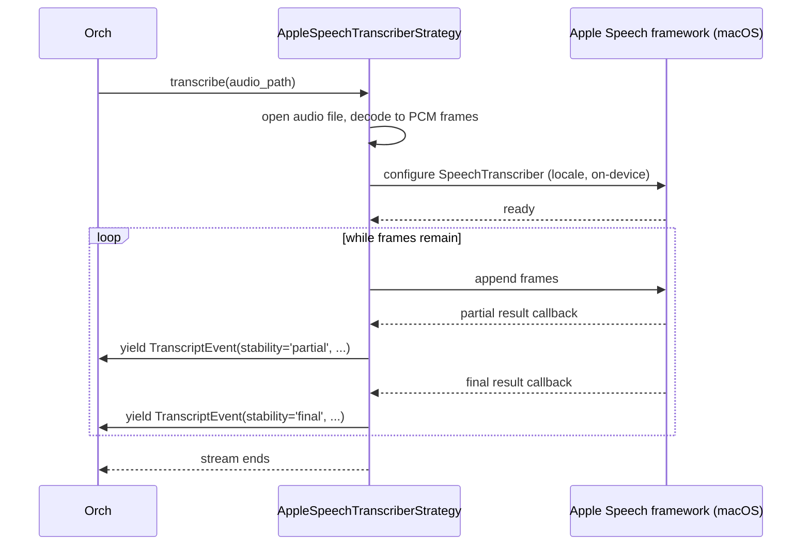
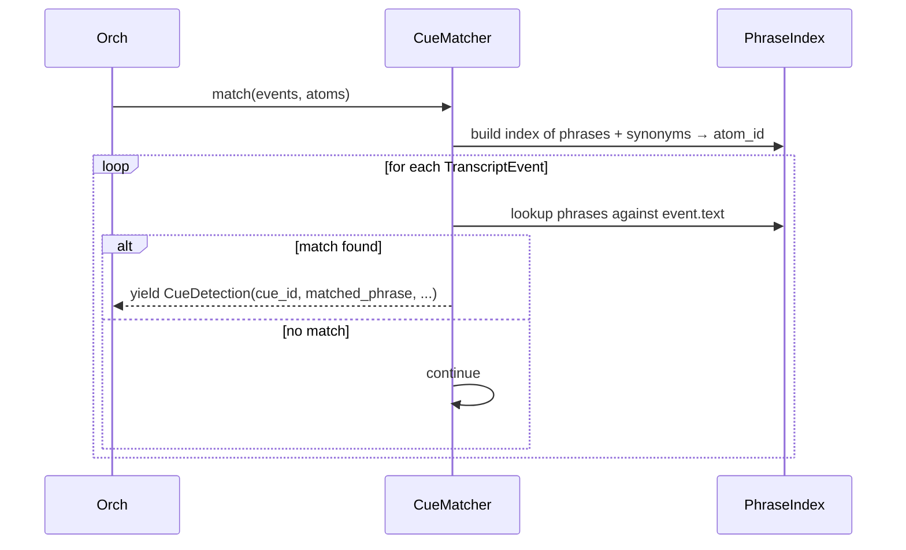
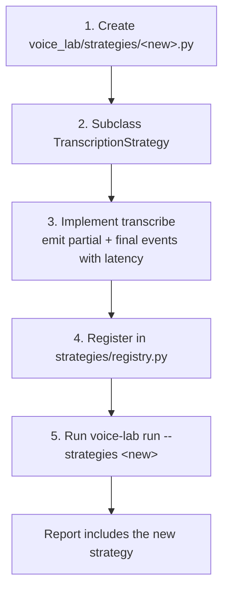
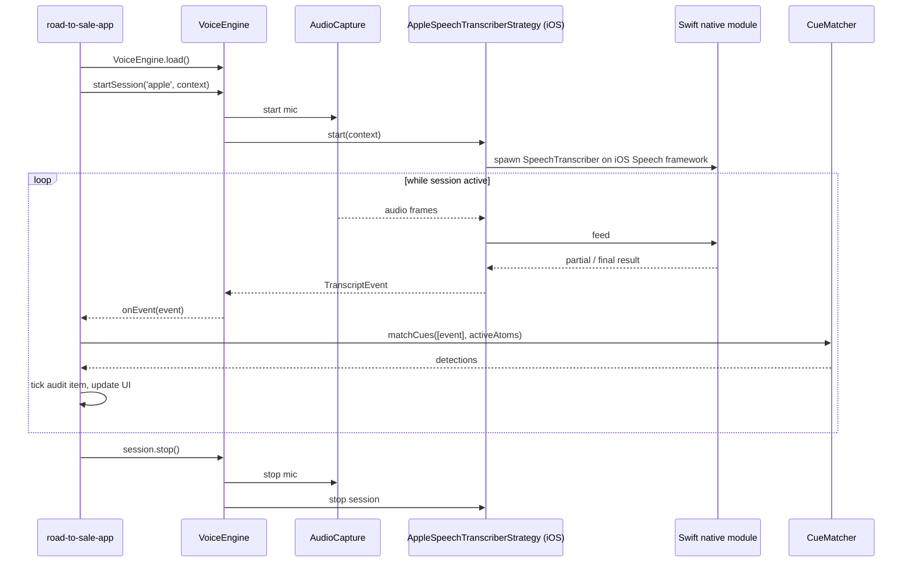
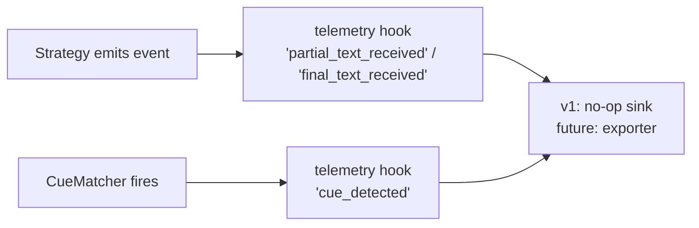

# Voice Engine — Code Flows

Last updated: `2026-05-22`

This document is the entry point for someone new to the voice engine. It traces actual code paths file-by-file. Diagrams over prose; concrete file names over abstraction.

## Top-level flow — Lab comparison run (end-to-end)

The flagship flow. One command, full matrix, comparison report out the other end. This is what makes the STT picking decision.

```mermaid
sequenceDiagram
  participant CLI as voice-lab CLI
  participant Orch as Lab Orchestrator
  participant Cat as VehicleFeatureCatalog
  participant Synth as SynthesisProvider
  participant Eng as VoiceEngineLab
  participant Strat as TranscriptionStrategy
  participant Match as CueMatcher
  participant Score as Scoring
  participant Report as ReportWriter

  CLI->>Orch: voice-lab run --strategies apple,argmax
  Orch->>Cat: VehicleFeatureCatalog.load(data_dir)
  Cat-->>Orch: catalog
  Orch->>Eng: VoiceEngineLab.load()
  Eng-->>Orch: engine

  loop for each script
    Orch->>Synth: ensure audio exists for (script, accents, noise levels)
    Synth-->>Orch: audio paths
    Orch->>Cat: list_features_for_trim(script.target_trim_id)
    Cat-->>Orch: list[Feature]
    Orch->>Orch: project Features → CueAtoms; merge with universal workflow atoms
    loop for each strategy × clip
      Orch->>Eng: transcribe_file(strategy_name, audio_path)
      Eng->>Strat: transcribe(audio_path)
      Strat-->>Eng: stream of TranscriptEvent (partial + final)
      Eng-->>Orch: events
      Orch->>Eng: match_cues(events, active_atoms)
      Eng->>Match: match(events, atoms)
      Match-->>Eng: stream of CueDetection
      Eng-->>Orch: detections
      Orch->>Score: classify(detections, script.expected_cues, script.negative_cues)
      Score-->>Orch: per-(clip, cue) result + latency stats
    end
  end

  Orch->>Report: write_run(run_id, results)
  Report-->>CLI: summary.md path
```

### Files touched, in order

1. **CLI entry:** `voice-engine/lab/src/voice_lab/cli.py` → `run` command
2. **Orchestrator:** `voice-engine/lab/src/voice_lab/orchestrator.py` — the only place that knows about both the catalog and the engine
3. **Catalog load:** `vehicle-feature-catalog/src/python/vehicle_feature_catalog/facade.py::load()`
4. **Engine load:** `voice-engine/lab/src/voice_lab/facade.py::VoiceEngineLab.load()`
5. **Per-script loop in:** `orchestrator.py::run_script()`
6. **Audio synthesis:** `voice-engine/lab/src/voice_lab/synthesis/elevenlabs.py` + `synthesis/noise.py` (idempotent — skips clips that exist)
7. **Feature lookup:** `catalog.list_features_for_trim(trim_id)`
8. **Atom projection:** `orchestrator.py::features_to_atoms(features)` + load `cue-packs/universal_workflow_cues.yaml`
9. **Transcription:** `engine.transcribe_file(strategy_name, audio_path)` → `voice_lab/strategies/<strategy>.py`
10. **Cue matching:** `engine.match_cues(events, atoms)` → `voice_lab/matcher/cue_matcher.py`
11. **Scoring:** `voice_lab/scoring/classify.py` — pass/partial/fail rules from the test matrix doc
12. **Reporting:** `voice_lab/reporting/markdown.py` + `reporting/csv.py` writes `reports/run-YYYYMMDD-HHmm/`

The orchestrator is the **only file** that knows about both the catalog and the engine. Everything else lives strictly inside one module.

## Flow — Inside a single strategy (Apple, lab side)

What happens when `transcribe_file` is called on `AppleSpeechTranscriberStrategy`.



**Files:** `voice_lab/strategies/apple_speech_transcriber.py` (single file). Apple framework calls go through Python ↔ Swift binding — exact mechanism flagged in PRD OQ1 / OQ2.

The **single file rule:** all Apple-SDK-specific code lives in this one file. Nothing outside it imports anything from the Apple Speech framework.

## Flow — Cue matching



**Files:** `voice_lab/matcher/cue_matcher.py`. The phrase index is rebuilt per call (atoms can change per script). Phrase matching is substring + synonym; case-insensitive; tokens normalized lightly (whitespace, punctuation).

A detection includes its triggering event so consumers can correlate timestamps and engine metadata.

## Flow — Adding a new STT strategy (developer story)



**Files touched:** two — the strategy file and the registry. No scoring, reporting, or orchestrator changes required. This is the strategy pattern paying off.

If the new strategy is a **cloud STT** (Deepgram, Gladia), it lives in the same `strategies/` folder; the only difference is that `transcribe()` makes a network call. Network failure surfaces as `TranscriptionError`.

## Flow — Live mobile session (designed-for, not built in v1)

The TS library path. Skeleton in v1, full implementation in a later PRD.



**The app — not the engine — composes the active atom set.** The app loads features from the catalog at session start (based on the rep's selected trim), merges with universal workflow cues, and passes the atom set to `matchCues`. The engine never sees the catalog.

## Flow — Telemetry hook points (v1 = hooks, no exporter)



In v1, telemetry hooks are call sites that emit structured event payloads to a no-op sink. The real exporter (file / network / dashboard) ships in a later PRD per `dev/docs/ROAD_TO_SALE_AUDIO_TELEMETRY.md`.

## What's NOT here

- Active-cue composition (universal ∪ feature) — lives in the lab orchestrator (and the future app), not the engine
- Audit item state tracking — `road-to-sale-app`
- Scraping or automated data ingestion — out of v1
- Cross-language type codegen — hand-written types in v1 (F1=a)
