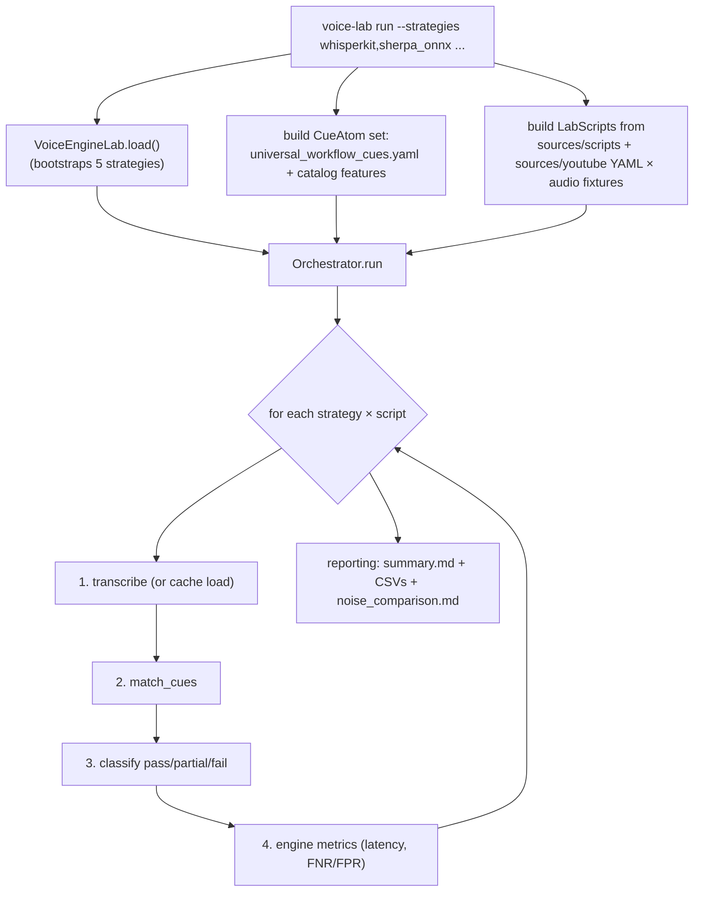
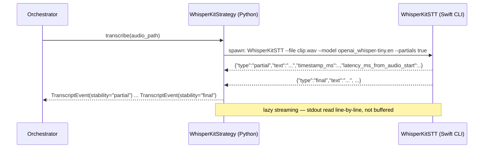
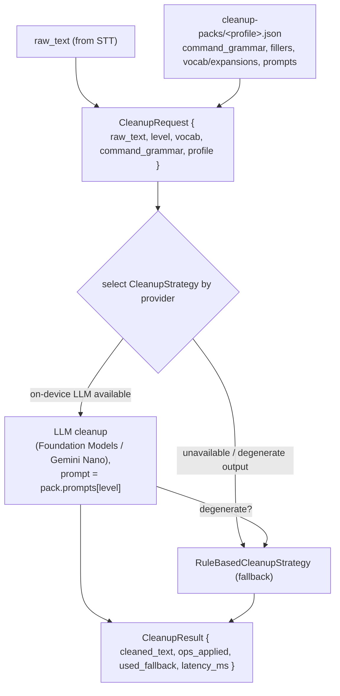
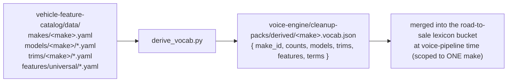

# Voice Engine — Code Flows

Last updated: `2026-06-22`

This traces the major flows through the module, file-by-file. It covers:

- **A.** A lab benchmark run (audio fixture → strategies → results/metrics)
- **B.** The cleanup flow (raw transcript → `CleanupStrategy` → cleaned text)
- **C.** How cleanup-packs are derived (`derive_vocab.py` → `cleanup-packs/derived/`)

> Reminder: only the Python lab actually *runs* here. The TS cleanup path is the
> reference contract; the live cleanup flow runs natively in the apps (see §B).
> Background: [`architecture.md`](./architecture.md),
> [`model-contracts.md`](./model-contracts.md).

---

## A. Lab benchmark run

The lab answers "which STT engine, at what accuracy/latency?" by running a
**(script × strategy)** matrix over audio fixtures. Entry point: the `voice-lab`
CLI, subcommand `run` (`lab/src/voice_lab/cli.py::_cmd_run`). The full five-stage
pipeline (sources → audio → noise → run → report) is documented in
[`../lab/docs/pipeline.md`](../lab/docs/pipeline.md); this is the `run` stage.

### Step list

1. **Parse + validate** — `_cmd_run` splits `--strategies`, calls
   `VoiceEngineLab.load()` (`facade.py` → `registry._bootstrap_default_strategies()`),
   and rejects unknown names against `list_strategies()`.
2. **Build cue atoms** — load workflow cues from
   `lab/cue-packs/universal_workflow_cues.yaml`, then project catalog `Feature`
   objects into `CueAtom`s (`source="feature"`). The engine never imports the
   catalog directly — the CLI does the projection.
3. **Build LabScripts** — pair source YAML scripts with audio fixtures under
   `lab/data/audio/{synthesized,youtube}/...`. Each `LabScript` carries
   `expected_cues`, `negative_cues`, `reference_text`, `audio_id`, `noise_level`.
4. **Orchestrate** — `Orchestrator.run()` (`orchestrator.py`) loops every
   strategy × script. Per cell, in `_run_one`:
   - **Transcribe** — `_get_events`: if a cached transcript exists at
     `data/transcripts/{strategy}/{audio_id}.jsonl`, load it (**cache hit, STT
     skipped**); else `engine.transcribe_file(strategy, audio_path)`. For native
     strategies this spawns the CLI subprocess and streams JSONL stdout into
     `TranscriptEvent`s, then writes the cache.
   - **Match** — `engine.match_cues(events, cue_atoms, use_semantic=...)`
     (`cue_matcher.py`, or `combined_matcher.py` when `--semantic`).
   - **Classify** — `scoring/classify.py::classify_run` → pass / partial / fail /
     false_positive per expected cue, with investigation evidence.
   - **Metrics** — `scoring/latency.py::compute_engine_metrics` (latency
     percentiles, transcription wall time).
   - A failure in any cell is caught, logged as `[SKIP]`, and recorded as `fail`
     classifications so one bad strategy doesn't abort the matrix.
5. **Aggregate + report** — false-negative/false-positive rates per strategy,
   then `reporting/markdown.py` writes `runs/results/{run_id}/summary.md` and
   `noise_comparison.md`; `reporting/csv_writer.py` writes per-strategy results +
   false-positive CSVs.

### The subprocess boundary (one transcribe cell)

`_event_from_json` (in `whisperkit.py`, shared by `sherpa_onnx.py`) validates
each line. A non-zero exit or malformed line raises `TranscriptionError` with a
build hint (`whisperkit_build.sh`, etc.).

---

## B. Cleanup flow (raw transcript → cleaned text)

Cleanup is the **second** model layer: it turns a raw STT transcript into clean
written text. The contract is `CleanupStrategy.clean(request) -> result`
([`api.md`](./api.md) §3). The TS `RuleBasedCleanupStrategy` is the reference;
the live flow runs natively in the apps.

### Rule-based reference (`src/cleanup/rule-based.ts`)

Order matters — this is the canonical fallback every platform must match:

1. If `level === 'off'` → return `raw_text` unchanged.
2. `applyCommands` — replace spoken command phrases longest-first
   (`"new paragraph" → "\n\n"`). → op `commands`.
3. `removeFillers` — strip `um, uh, erm, …` (and "you know", "i mean", …). → op `fillers`.
4. `collapseRepeatedWords` (**`full` only**) — "the the car" → "the car". → op `repeats`.
5. `normalizeWhitespaceAndCaps` — collapse spaces, fix space-before-punctuation,
   sentence-case, standalone `i` → `I`. → op `punctuation`.
6. `applyVocab` — forced spellings/replacements **last** so the LLM (if used)
   can't undo them. → op `vocab`.

Every transformation appends to `ops_applied` for telemetry. It **never
paraphrases** — only normalizes.

### Where the live flow runs (native)

| Platform | LLM strategy | Fallback | Files |
|---|---|---|---|
| macOS / iOS (dictation) | `FoundationModelsCleanup` | `RuleBasedCleanup` | `../../dictation/Shared/Sources/DictationCore/{TextCleanup,FoundationModelsCleanup,RuleBasedCleanup}.swift` |
| Android | Gemini Nano / MediaPipe LLM (planned) | rule-based | — |

The dictation app's `TextCleanup` protocol mirrors `CleanupStrategy`, loads
`{profile}-cleanup-pack.json` (the same pack shape shipped from
[`../cleanup-packs/`](../cleanup-packs/)), uses `pack.prompts[level]` as the LLM
system prompt, and falls back to the rule-based path on failure. See
[`../../dictation/docs/architecture.md`](../../dictation/docs/architecture.md).

---

## C. How cleanup-packs are derived

The `road-to-sale.json` lexicon is the hand-authored dealership glossary. The
**per-make** vocabulary (so a Honda store gets Honda model/trim/feature names,
which generic STT otherwise mangles) is **generated** from the vehicle catalog —
no manual typing.

Script: `vehicle-feature-catalog/scripts/derive_vocab.py` (RTS task #7).

### Step list

1. `python3 vehicle-feature-catalog/scripts/derive_vocab.py [make_id ...]`
   (defaults to every make in `data/makes/`).
2. For each make: collect model names (`data/models/<make>/`), trim names
   (`data/trims/<make>/`), and universal feature display names + short synonyms
   (≤3 words, sentence-like `cue_phrases` excluded — those aren't vocabulary).
3. Dedupe case-insensitively; order `models + trims` (highest dealer value)
   before `features`.
4. Write `voice-engine/cleanup-packs/derived/<make>.vocab.json` with `counts` and
   the term lists. Marked `"source": "...(derived; do not hand-edit)"`.
5. The RTS voice pipeline merges that term list into the road-to-sale lexicon
   bucket — the same bucket the hand-authored glossary (`lexicon.terms` in
   `road-to-sale.json`) fills. Scoped to **one** make so it fits WhisperKit's
   small bias window.

> Data direction is one-way: the catalog *writes into* `cleanup-packs/derived/`.
> The voice engine never imports the catalog as code. `derived/` is generated
> output (gitignored), not a hand-authored source.

---

## See also

- [`../lab/docs/pipeline.md`](../lab/docs/pipeline.md) — full five-stage lab pipeline (synth / noise / run / report)
- [`../lab/docs/cues-and-strategies.md`](../lab/docs/cues-and-strategies.md) — cue system + adding a strategy
- [`../lab/docs/data-layout.md`](../lab/docs/data-layout.md) — file formats and the three-layer data model
- [`model-contracts.md`](./model-contracts.md) — the two model contracts in depth
- [`../../docs/architecture.md`](../../docs/architecture.md) — whole-system map
- [`../../docs/ROAD_TO_SALE_AUDIO_ARCHITECTURE.md`](../../docs/ROAD_TO_SALE_AUDIO_ARCHITECTURE.md) — the two-lane (live + evidence) audio design
